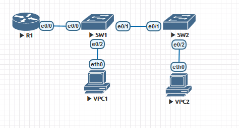

# Configure Router-on-a-Stick Inter-VLAN Routing



## VPC1 configuration
```
VPCS> ip 192.168.3.3/24 192.168.3.1
Checking for duplicate address...
PC1 : 192.168.3.3 255.255.255.0 gateway 192.168.3.1
```

## VPC2 configuration
```
VPCS> ip 192.168.4.3/24 192.168.4.1
Checking for duplicate address...
PC1 : 192.168.4.3 255.255.255.0 gateway 192.168.4.1
```

## R1 configuration
```
Router>enable
Router#configure terminal
Router#hostname r1
r1(config)#interface e0/0.3
r1(config-subif)#Description Default Gateway for VLAN 3
r1(config-subif)#encapsulation dot1q 3
r1(config-subif)#ip add 192.168.3.1 255.255.255.0
r1(config-subif)#exit
r1(config)#interface e0/0.1
r1(config-subif)#Description Default Gateway for VLAN 1
r1(config-subif)#encapsulation dot1q 1
r1(config-subif)#ip add 192.168.4.1 255.255.255.0
r1(config-subif)#exit
r1(config)#interface e0/0
r1(config-if)#Description Trunk link to SW1
r1(config-if)#no shut
r1(config-if)#end
```

## SW1
### SW1 VLAN config
```
Switch>enable
Switch#configure terminal
Switch#hostname sw1
sw1(config)#ip default-gateway 192.168.3.1
sw1(config)#interface vlan 3
sw1(config-if)#ip address 192.168.3.11 255.255.255.0
sw1(config-if)#no shutdown
sw1(config-if)#end
sw1#configure terminal
sw1(config)#interface e1/1
sw1(config-if)#Switchport mode access
sw1(config-if)#Switchport access vlan 3
sw1(config-if)#end
sw1#copy running-config startup-config
Destination filename [startup-config]? yes
%Error copying nvram:yes (Invalid argument)
sw1#copy running-config startup-config
Destination filename [startup-config]?
Building configuration...
Compressed configuration from 1840 bytes to 909 bytes[OK]
```
```
sw1#show vlan brief

VLAN Name                             Status    Ports
---- -------------------------------- --------- -------------------------------
1    default                          active    Et0/0, Et0/2, Et0/3, Et1/0
                                                Et1/2, Et1/3, Et2/0, Et2/1
                                                Et2/2, Et2/3, Et3/0, Et3/1
                                                Et3/2, Et3/3, Et4/0, Et4/1
                                                Et4/2, Et4/3, Et5/0, Et5/1
                                                Et5/2, Et5/3
3    vlan3                            active    Et1/1
1002 fddi-default                     act/unsup
1003 token-ring-default               act/unsup
1004 fddinet-default                  act/unsup
1005 trnet-default                    act/unsup
```
### SW1 trunk to SW2
```
sw1#configure terminal
sw1(config)#interface e0/1
sw1(config-if)#Switchport trunk encapsulation dot1q
sw1(config-if)#Switchport mode trunk
sw1(config-if)#Switchport trunk native vlan 3
sw1(config-if)#Switchport trunk allowed vlan 3
sw1(config-if)#end
```
```
sw1#show interface e0/1 switchport
Name: Et0/1
Switchport: Enabled
Administrative Mode: trunk
Operational Mode: trunk
Administrative Trunking Encapsulation: dot1q
Operational Trunking Encapsulation: dot1q
Negotiation of Trunking: On
Access Mode VLAN: 1 (default)
Trunking Native Mode VLAN: 3 (vlan3)
Administrative Native VLAN tagging: enabled
Voice VLAN: none
Administrative private-vlan host-association: none
Administrative private-vlan mapping: none
Administrative private-vlan trunk native VLAN: none
Administrative private-vlan trunk Native VLAN tagging: enabled
Administrative private-vlan trunk encapsulation: dot1q
Administrative private-vlan trunk normal VLANs: none
Administrative private-vlan trunk associations: none
Administrative private-vlan trunk mappings: none
Operational private-vlan: none
Trunking VLANs Enabled: 3
Pruning VLANs Enabled: 2-1001
Capture Mode Disabled
Capture VLANs Allowed: ALL

Appliance trust: none
```

### SW1 trunk to R1
```
sw1#configure terminal
sw1(config)#interface e2/0
sw1(config-if)#Switchport trunk encapsulation dot1q
sw1(config-if)#Switchport mode trunk
sw1(config-if)#Switchport trunk native vlan 3
sw1(config-if)#Switchport trunk allowed vlan 3
sw1(config-if)#end
```

## SW2
### SW2 VLAN config
```
Switch>enable
Switch#configure terminal
Switch#hostname sw2
sw2(config)#ip default-gateway 192.168.3.1
sw2(config)#interface vlan 3
sw2(config-if)#ip address 192.168.3.12 255.255.255.0
sw2(config-if)#no shutdown
sw2(config-if)#end
sw1#configure terminal
sw1(config)#interface e4/1
sw1(config-if)#Switchport mode access
sw1(config-if)#Switchport access vlan 3
sw1(config-if)#end
*Aug 16 13:11:34.166: %SYS-5-CONFIG_I: Configured from console by console
sw2#copy running-config startup-config
Destination filename [startup-config]?
Building configuration...
Compressed configuration from 1855 bytes to 921 bytes[OK]
```
```
sw2#show vlan brief

VLAN Name                             Status    Ports
---- -------------------------------- --------- -------------------------------
1    default                          active    Et0/0, Et0/2, Et0/3, Et1/0
                                                Et1/1, Et1/2, Et1/3, Et2/0
                                                Et2/1, Et2/2, Et2/3, Et3/0
                                                Et3/1, Et3/2, Et3/3, Et4/0
                                                Et4/2, Et4/3, Et5/0, Et5/1
                                                Et5/2, Et5/3
3    VLAN0003                         active    Et4/1
1002 fddi-default                     act/unsup
1003 token-ring-default               act/unsup
1004 fddinet-default                  act/unsup
1005 trnet-default                    act/unsup
```

### SW2 trunk to SW1
```
sw2#configure terminal
sw2(config)#interface e0/1
sw2(config-if)#Switchport trunk encapsulation dot1q
sw2(config-if)#Switchport mode trunk
sw2(config-if)#Switchport trunk native vlan 3
sw2(config-if)#Switchport trunk allowed vlan 3
sw2(config-if)#end
```
```
sw2#show interface e0/1 switchport
Name: Et0/1
Switchport: Enabled
Administrative Mode: trunk
Operational Mode: trunk
Administrative Trunking Encapsulation: dot1q
Operational Trunking Encapsulation: dot1q
Negotiation of Trunking: On
Access Mode VLAN: 1 (default)
Trunking Native Mode VLAN: 3 (VLAN0003)
Administrative Native VLAN tagging: enabled
Voice VLAN: none
Administrative private-vlan host-association: none
Administrative private-vlan mapping: none
Administrative private-vlan trunk native VLAN: none
Administrative private-vlan trunk Native VLAN tagging: enabled
Administrative private-vlan trunk encapsulation: dot1q
Administrative private-vlan trunk normal VLANs: none
Administrative private-vlan trunk associations: none
Administrative private-vlan trunk mappings: none
Operational private-vlan: none
Trunking VLANs Enabled: 3
Pruning VLANs Enabled: 2-1001
Capture Mode Disabled
Capture VLANs Allowed: ALL

Appliance trust: none
```
## Ping test from PC1 to R1 gateway
```
VPCS> ping 192.168.3.1

84 bytes from 192.168.3.1 icmp_seq=1 ttl=255 time=1.881 ms
84 bytes from 192.168.3.1 icmp_seq=2 ttl=255 time=2.373 ms
```

## Ping test from PC2 to R1 gateway
```
VPCS> ping 192.168.4.1

84 bytes from 192.168.4.1 icmp_seq=1 ttl=255 time=1.951 ms
84 bytes from 192.168.4.1 icmp_seq=2 ttl=255 time=2.593 ms
```
