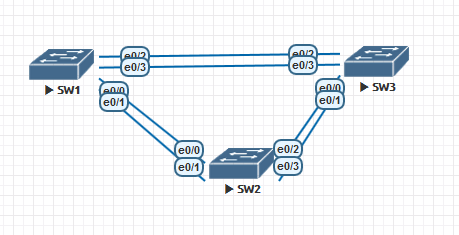

### STP (Spanning Tree) protocol



## SW1
```
Switch>enable
Switch#conf t
Switch(config)#hostname sw1
sw1(config)#enable password class
sw1(config)#end
sw1#conf t
sw1(config)#line vty 0
sw1(config-line)#login
sw1(config-line)#password cisco
sw1(config-line)#end
sw1#conf t
sw1(config)#line console 0
sw1(config-line)#logging synchronous
sw1(config-line)#password cisco
sw1(config-line)#motd-banner !Unathorized access is prohibited!
sw1(config-line#end
sw1#conf t
sw1(config)#no ip domain lookup
sw1(config)#interface vlan 1
sw1(config-if)#ip add
sw1(config-if)#ip address 192.168.1.1 255.255.255.0
sw1(config-if)#no shutdown
sw1(config-if)#end
sw1#copy running-config startup-config
```

## SW2
```
Switch>enable
Switch#conf t
Switch(config)#hostname sw2
sw2(config)#enable password class
sw2(config)#end
sw2#conf t
sw2(config)#line vty 0
sw2(config-line)#login
sw2(config-line)#password cisco
sw2(config-line)#end
sw2#conf t
sw2(config)#line console 0
sw2(config-line)#logging synchronous
sw2(config-line)#password cisco
sw2(config-line)#login
sw2(config-line)#motd-banner !Unathorized access is prohibited!
sw2(config-line#end
sw2#conf t
sw2(config)#no ip domain lookup
sw2(config)#interface vlan 1
sw2(config-if)#ip add
sw2(config-if)#ip address 192.168.1.2 255.255.255.0
sw2(config-if)#no shutdown
sw2(config-if)#end
sw2#copy running-config startup-config
```

## SW3
```
Switch>enable
Switch#conf t
Switch(config)#hostname sw3
sw3(config)#enable password class
sw3(config)#end
sw3#conf t
sw3(config)#line vty 0
sw3(config-line)#login
sw3(config-line)#password cisco
sw3(config-line)#end
sw3#conf t
sw3(config)#line console 0
sw3(config-line)#logging synchronous
sw3(config-line)#password cisco
sw3(config-line)#login
sw3(config-line)#motd-banner !Unathorized access is prohibited!
sw3(config-line#end
sw3#conf t
sw3(config)#no ip domain lookup
sw3(config)#interface vlan 1
sw3(config-if)#ip add
sw3(config-if)#ip address 192.168.1.3 255.255.255.0
sw3(config-if)#no shutdown
sw3(config-if)#end
sw3#copy running-config startup-config
```

## ping test between SW1/SW2/SW3
```
sw1#ping 192.168.1.2
Type escape sequence to abort.
Sending 5, 100-byte ICMP Echos to 192.168.1.2, timeout is 2 seconds:
!!!!!
Success rate is 100 percent (5/5), round-trip min/avg/max = 1/1/2 ms
```
```
sw1#ping 192.168.1.3
Type escape sequence to abort.
Sending 5, 100-byte ICMP Echos to 192.168.1.3, timeout is 2 seconds:
!!!!!
Success rate is 100 percent (5/5), round-trip min/avg/max = 1/1/1 ms
```
```
sw2#ping 192.168.1.3
Type escape sequence to abort.
Sending 5, 100-byte ICMP Echos to 192.168.1.3, timeout is 2 seconds:
!!!!!
Success rate is 100 percent (5/5), round-trip min/avg/max = 1/1/1 ms
```

## SW1 enable trunking ports
```
sw1#conf t
sw1(config)#interface e0/0
sw1(config-if)#shutdown
sw1(config-if)#interface e0/1
sw1(config-if)#shutdown
sw1(config-if)#interface e0/2
sw1(config-if)#shutdown
sw1(config-if)#interface e0/3
sw1(config-if)#shutdown
sw1(config-if)#end
sw1(config)#conf t
sw1(config)#int eth 0/0
sw1(config-if)#switchport trunk encapsulation dot1q
sw1(config-if)#switchport mode trunk
sw1(config-if)#switchport trunk native vlan 1
sw1(config-if)#int eth 0/1
sw1(config-if)#switchport trunk encapsulation dot1q
sw1(config-if)#switchport mode trunk
sw1(config-if)#switchport trunk native vlan 1
sw1(config-if)#int eth 0/2
sw1(config-if)#switchport trunk encapsulation dot1q
sw1(config-if)#switchport mode trunk
sw1(config-if)#switchport trunk native vlan 1
sw1(config-if)#int eth 0/3
sw1(config-if)#switchport trunk encapsulation dot1q
sw1(config-if)#switchport mode trunk
sw1(config-if)#switchport trunk native vlan 1
sw1(config-if)#int eth 0/1
sw1(config-if)#no shutdown
sw1(config-if)#int eth 0/3
sw1(config-if)#no shutdown
```
## SW2 enable trunking ports
```
sw2#conf t
sw2(config)#interface e0/0
sw2(config-if)#shutdown
sw2(config-if)#interface e0/1
sw2(config-if)#shutdown
sw2(config-if)#interface e0/2
sw2(config-if)#shutdown
sw2(config-if)#interface e0/3
sw2(config-if)#shutdown
sw2(config-if)#int eth 0/0
sw2(config-if)#switchport trunk encapsulation dot1q
sw2(config-if)#switchport mode trunk
sw2(config-if)#switchport trunk native vlan 1
sw2(config-if)#int eth 0/1
sw2(config-if)#switchport trunk encapsulation dot1q
sw2(config-if)#switchport mode trunk
sw2(config-if)#switchport trunk native vlan 1
sw2(config-if)#int eth 0/2
sw2(config-if)#switchport trunk encapsulation dot1q
sw2(config-if)#switchport mode trunk
sw2(config-if)#switchport trunk native vlan 1
sw2(config-if)#int eth 0/3
sw2(config-if)#switchport trunk encapsulation dot1q
sw2(config-if)#switchport mode trunk
sw2(config-if)#switchport trunk native vlan 1
sw2(config-if)#int eth 0/1
sw2(config-if)#no shutdown
sw2(config-if)#int eth 0/3
sw2(config-if)#no shutdown
```
## SW3 enable trunking ports
```
sw3#conf t
sw3(config)#interface e0/0
sw3(config-if)#shutdown
sw3(config-if)#interface e0/1
sw3(config-if)#shutdown
sw3(config-if)#interface e0/2
sw3(config-if)#shutdown
sw3(config-if)#interface e0/3
sw3(config-if)#shutdown
sw3(config-if)#int eth 0/0
sw3(config-if)#switchport trunk encapsulation dot1q
sw3(config-if)#switchport mode trunk
sw3(config-if)#switchport trunk native vlan 1
sw3(config-if)#int eth 0/1
sw3(config-if)#switchport trunk encapsulation dot1q
sw3(config-if)#switchport mode trunk
sw3(config-if)#switchport trunk native vlan 1
sw3(config-if)#int eth 0/2
sw3(config-if)#switchport trunk encapsulation dot1q
sw3(config-if)#switchport mode trunk
sw3(config-if)#switchport trunk native vlan 1
sw3(config-if)#int eth 0/3
sw3(config-if)#switchport trunk encapsulation dot1q
sw3(config-if)#switchport mode trunk
sw3(config-if)#switchport trunk native vlan 1
sw3(config-if)#int eth 0/1
sw3(config-if)#no shutdown
sw3(config-if)#int eth 0/3
sw3(config-if)#no shutdown
```
## Checking spanning-tree state
```
sw1#show spanning-tree

VLAN0001
  Spanning tree enabled protocol ieee
  Root ID    Priority    32769
             Address     aabb.cc00.1000
             This bridge is the root
             Hello Time   2 sec  Max Age 20 sec  Forward Delay 15 sec

  Bridge ID  Priority    32769  (priority 32768 sys-id-ext 1)
             Address     aabb.cc00.1000
             Hello Time   2 sec  Max Age 20 sec  Forward Delay 15 sec
             Aging Time  300 sec

Interface           Role Sts Cost      Prio.Nbr Type
------------------- ---- --- --------- -------- --------------------------------
Et0/1               Desg FWD 100       128.2    Shr
Et0/3               Desg FWD 100       128.4    Shr
```
```
sw2#show spanning-tree

VLAN0001
  Spanning tree enabled protocol ieee
  Root ID    Priority    32769
             Address     aabb.cc00.1000
             Cost        100
             Port        2 (Ethernet0/1)
             Hello Time   2 sec  Max Age 20 sec  Forward Delay 15 sec

  Bridge ID  Priority    32769  (priority 32768 sys-id-ext 1)
             Address     aabb.cc00.2000
             Hello Time   2 sec  Max Age 20 sec  Forward Delay 15 sec
             Aging Time  300 sec

Interface           Role Sts Cost      Prio.Nbr Type
------------------- ---- --- --------- -------- --------------------------------
Et0/1               Root FWD 100       128.2    Shr
Et0/3               Desg FWD 100       128.4    Shr
```
```
sw3#show spanning-tree

VLAN0001
  Spanning tree enabled protocol ieee
  Root ID    Priority    32769
             Address     aabb.cc00.1000
             Cost        100
             Port        4 (Ethernet0/3)
             Hello Time   2 sec  Max Age 20 sec  Forward Delay 15 sec

  Bridge ID  Priority    32769  (priority 32768 sys-id-ext 1)
             Address     aabb.cc00.3000
             Hello Time   2 sec  Max Age 20 sec  Forward Delay 15 sec
             Aging Time  300 sec

Interface           Role Sts Cost      Prio.Nbr Type
------------------- ---- --- --------- -------- --------------------------------
Et0/1               Altn BLK 100       128.2    Shr
Et0/3               Root FWD 100       128.4    Shr

## Changing port's cost on SW1

sw1(config)#int eth 0/3
sw1(config-if)#spanning-tree cost 18
sw1#show spanning-tree
```
```
sw1#show spanning-tree

VLAN0001
  Spanning tree enabled protocol ieee
  Root ID    Priority    32769
             Address     aabb.cc00.1000
             This bridge is the root
             Hello Time   2 sec  Max Age 20 sec  Forward Delay 15 sec

  Bridge ID  Priority    32769  (priority 32768 sys-id-ext 1)
             Address     aabb.cc00.1000
             Hello Time   2 sec  Max Age 20 sec  Forward Delay 15 sec
             Aging Time  300 sec

Interface           Role Sts Cost      Prio.Nbr Type
------------------- ---- --- --------- -------- --------------------------------
Et0/1               Desg FWD 18        128.2    Shr
Et0/3               Desg FWD 100       128.4    Shr

```
```
sw3#show spanning-tree

VLAN0001
  Spanning tree enabled protocol ieee
  Root ID    Priority    32769
             Address     aabb.cc00.1000
             Cost        100
             Port        4 (Ethernet0/3)
             Hello Time   2 sec  Max Age 20 sec  Forward Delay 15 sec

  Bridge ID  Priority    32769  (priority 32768 sys-id-ext 1)
             Address     aabb.cc00.3000
             Hello Time   2 sec  Max Age 20 sec  Forward Delay 15 sec
             Aging Time  300 sec

Interface           Role Sts Cost      Prio.Nbr Type
------------------- ---- --- --------- -------- --------------------------------
Et0/1               Altn BLK 100       128.2    Shr
Et0/3               Root FWD 100       128.4    Shr
```

## Disable STP cost

```
sw1(config)#int eth 0/1
sw1(config-if)#no spanning-tree cost 18

```
```
sw1#show spanning-tree

sw1#show spanning-tree

VLAN0001
  Spanning tree enabled protocol ieee
  Root ID    Priority    32769
             Address     aabb.cc00.1000
             This bridge is the root
             Hello Time   2 sec  Max Age 20 sec  Forward Delay 15 sec

  Bridge ID  Priority    32769  (priority 32768 sys-id-ext 1)
             Address     aabb.cc00.1000
             Hello Time   2 sec  Max Age 20 sec  Forward Delay 15 sec
             Aging Time  300 sec

Interface           Role Sts Cost      Prio.Nbr Type
------------------- ---- --- --------- -------- --------------------------------
Et0/1               Desg FWD 100       128.2    Shr
Et0/3               Desg FWD 100       128.4    Shr
```

## Enabling ports 0/0 and 0/2 on SW1-3
```
sw1(config)#int eth 0/0
sw1(config-if)#no shutdown
sw1(config)#int eth 0/2
sw1(config-if)#no shutdown
```
```
sw2(config)#int eth 0/0
sw2(config-if)#no shutdown
sw2(config)#int eth 0/2
sw2(config-if)#no shutdown
```
```
sw3(config)#int eth 0/0
sw3(config-if)#no shutdown
sw3(config)#int eth 0/2
sw3(config-if)#no shutdown
```

```
sw1#show spanning-tree

VLAN0001
  Spanning tree enabled protocol ieee
  Root ID    Priority    32769
             Address     aabb.cc00.1000
             This bridge is the root
             Hello Time   2 sec  Max Age 20 sec  Forward Delay 15 sec

  Bridge ID  Priority    32769  (priority 32768 sys-id-ext 1)
             Address     aabb.cc00.1000
             Hello Time   2 sec  Max Age 20 sec  Forward Delay 15 sec
             Aging Time  300 sec

Interface           Role Sts Cost      Prio.Nbr Type
------------------- ---- --- --------- -------- --------------------------------
Et0/0               Desg FWD 100       128.1    Shr
Et0/1               Desg FWD 100       128.2    Shr
Et0/2               Desg FWD 100       128.3    Shr
Et0/3               Desg FWD 100       128.4    Shr
```
```
sw2#show spanning-tree

VLAN0001
  Spanning tree enabled protocol ieee
  Root ID    Priority    32769
             Address     aabb.cc00.1000
             Cost        100
             Port        1 (Ethernet0/0)
             Hello Time   2 sec  Max Age 20 sec  Forward Delay 15 sec

  Bridge ID  Priority    32769  (priority 32768 sys-id-ext 1)
             Address     aabb.cc00.2000
             Hello Time   2 sec  Max Age 20 sec  Forward Delay 15 sec
             Aging Time  300 sec

Interface           Role Sts Cost      Prio.Nbr Type
------------------- ---- --- --------- -------- --------------------------------
Et0/0               Root FWD 100       128.1    Shr
Et0/1               Altn BLK 100       128.2    Shr
Et0/2               Desg FWD 100       128.3    Shr
Et0/3               Desg FWD 100       128.4    Shr
```
```
sw3#show spanning-tree

VLAN0001
  Spanning tree enabled protocol ieee
  Root ID    Priority    32769
             Address     aabb.cc00.1000
             Cost        100
             Port        3 (Ethernet0/2)
             Hello Time   2 sec  Max Age 20 sec  Forward Delay 15 sec

  Bridge ID  Priority    32769  (priority 32768 sys-id-ext 1)
             Address     aabb.cc00.3000
             Hello Time   2 sec  Max Age 20 sec  Forward Delay 15 sec
             Aging Time  300 sec

Interface           Role Sts Cost      Prio.Nbr Type
------------------- ---- --- --------- -------- --------------------------------
Et0/0               Altn BLK 100       128.1    Shr
Et0/1               Altn BLK 100       128.2    Shr
Et0/2               Root FWD 100       128.3    Shr
Et0/3               Altn BLK 100       128.4    Shr
```