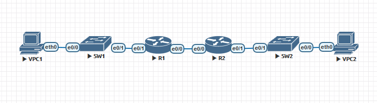

# Configure DHCPv4



## R1 configuration
```
Router>enable
Router#conf t
Router#hostname r1
r1(config)#enable password class
r1(config)#end
r1#conf t
r1(config)#line vty 0
r1(config-line)#login
r1(config-line)#password cisco
r1(config-line)#end
r1#conf t
r1(config)#line console 0
r1(config-line)#logging synchronous
r1(config-line)#password cisco
r1(config-line)#motd-banner !Unathorized access is prohibited!
r1(config-line)#end
r1#conf t
r1(config)#service password-encryption
r1(config)#no ip domain lookup
r1(config)#clock timezone GMT +3
r1(config)#end
r1#clock set 8:00:00 Aug 27 2021
r1#copy running-config startup-config
r1#show clock

r1#conf t
r1(config)#int eth 0/0
r1(config-if)#Description R1 to R2 comm
r1(config-if)#ip add 10.0.0.1 255.255.255.252
r1(config-if)#no shut
r1(config-if)#int eth 0/1
r1(config-if)#Description R1 to SW1 comm
r1(config-if)#no ip address
r1(config-if)#no shut
r1(config)#int eth 0/1.100
r1(config-subif)#Description VLAN 100
r1(config-subif)#encapsulation dot1q 100
r1(config-subif)#ip add 192.168.1.1 255.255.255.192
r1(config-subif)#no shut
r1(config)#int eth 0/1.200
r1(config-subif)#Description VLAN 200
r1(config-subif)#encapsulation dot1q 200
r1(config-subif)#ip add 192.168.1.65 255.255.255.224
r1(config-subif)#int eth 0/1.1000
r1(config-subif)#encapsulation dot1q 1000 native
r1(config-subif)#no ip address
r1(config-subif)#end
r1#copy running-config startup-config
```
```
r1#show ip interface brief
Interface                  IP-Address      OK? Method Status                Protocol
Ethernet0/0                10.0.0.1        YES NVRAM  up                    up  
Ethernet0/1                unassigned      YES NVRAM  up                    up  
Ethernet0/1.100            192.168.1.1     YES manual up                    up  
Ethernet0/1.200            192.168.1.65    YES manual up                    up  
Ethernet0/1.1000           unassigned      YES unset  up                    up  
Ethernet0/2                unassigned      YES NVRAM  administratively down down
Ethernet0/3                unassigned      YES NVRAM  administratively down down
```
## R1 adding static routes
```
r1#conf t
r1(config)#ip route 192.168.1.96 255.255.255.240 10.0.0.2
```
```
r1#show ip route
Codes: L - local, C - connected, S - static, R - RIP, M - mobile, B - BGP
       D - EIGRP, EX - EIGRP external, O - OSPF, IA - OSPF inter area
       N1 - OSPF NSSA external type 1, N2 - OSPF NSSA external type 2
       E1 - OSPF external type 1, E2 - OSPF external type 2
       i - IS-IS, su - IS-IS summary, L1 - IS-IS level-1, L2 - IS-IS level-2
       ia - IS-IS inter area, * - candidate default, U - per-user static route
       o - ODR, P - periodic downloaded static route, H - NHRP, l - LISP
       a - application route
       + - replicated route, % - next hop override

Gateway of last resort is not set

      10.0.0.0/8 is variably subnetted, 2 subnets, 2 masks
C        10.0.0.0/30 is directly connected, Ethernet0/0
L        10.0.0.1/32 is directly connected, Ethernet0/0
      192.168.1.0/24 is variably subnetted, 5 subnets, 4 masks
C        192.168.1.0/26 is directly connected, Ethernet0/1.100
L        192.168.1.1/32 is directly connected, Ethernet0/1.100
C        192.168.1.64/27 is directly connected, Ethernet0/1.200
L        192.168.1.65/32 is directly connected, Ethernet0/1.200
S        192.168.1.96/28 [1/0] via 10.0.0.2
```
## R2 configuration
```
Router>enable
Router#conf t
Router#hostname r1
r2(config)#enable password class
r2(config)#end
r2#conf t
r2(config)#line vty 0
r2(config-line)#login
r2(config-line)#password cisco
r2(config-line)#end
r2#conf t
r2(config)#line console 0
r2(config-line)#logging synchronous
r2(config-line)#password cisco
r2(config-line)#motd-banner !Unathorized access is prohibited!
r2(config-line)#end
r2#conf t
r2(config)#service password-encryption
r2(config)#no ip domain lookup
r2(config)#clock timezone GMT +3
r2(config)#end
r2#clock set 8:00:00 Aug 27 2021
r2#copy running-config startup-config
r2#show clock

r2#conf t
r2(config)#int eth 0/0
r2(config-if)#Description R2 to R1 comm
r2(config-if)#ip add 10.0.0.2 255.255.255.252
r2(config-if)#no shut
r2(config-if)#int eth 0/1
r2(config-if)#Description R2 to SW2 comm
r2(config-if)#ip address 192.168.1.97 255.255.255.240
r2(config-if)#no shut
r2(config-if)#end
r2#copy running-config startup-config
```
```
r2#show ip interface brief
Interface                  IP-Address      OK? Method Status                Protocol
Ethernet0/0                10.0.0.2        YES NVRAM  up                    up  
Ethernet0/1                192.168.1.97    YES manual up                    up  
Ethernet0/2                unassigned      YES NVRAM  administratively down down
Ethernet0/3                unassigned      YES NVRAM  administratively down down
```
## R2 adding static routes
```
r2#conf t
r2(config)#ip route 192.168.1.0 255.255.255.192 10.0.0.1
r2(config)#ip route 192.168.1.64 255.255.255.224 10.0.0.1
```
```
r2#show ip route
Codes: L - local, C - connected, S - static, R - RIP, M - mobile, B - BGP
       D - EIGRP, EX - EIGRP external, O - OSPF, IA - OSPF inter area
       N1 - OSPF NSSA external type 1, N2 - OSPF NSSA external type 2
       E1 - OSPF external type 1, E2 - OSPF external type 2
       i - IS-IS, su - IS-IS summary, L1 - IS-IS level-1, L2 - IS-IS level-2
       ia - IS-IS inter area, * - candidate default, U - per-user static route
       o - ODR, P - periodic downloaded static route, H - NHRP, l - LISP
       a - application route
       + - replicated route, % - next hop override

Gateway of last resort is not set

      10.0.0.0/8 is variably subnetted, 2 subnets, 2 masks
C        10.0.0.0/30 is directly connected, Ethernet0/0
L        10.0.0.2/32 is directly connected, Ethernet0/0
      192.168.1.0/24 is variably subnetted, 4 subnets, 4 masks
S        192.168.1.0/26 [1/0] via 10.0.0.1
S        192.168.1.64/27 [1/0] via 10.0.0.1
C        192.168.1.96/28 is directly connected, Ethernet0/1
L        192.168.1.97/32 is directly connected, Ethernet0/1
```
## Configure two DHCPv4 Server on R1
```
r1#conf t
r1(config)#ip dhcp pool vlan100DHCP
r1(dhcp-config)#network 192.168.1.0 255.255.255.192
r1(dhcp-config)#domain-name ccna-lab.com
r1(dhcp-config)#default-router 192.168.1.1
r1(dhcp-config)#lease 2
r1(dhcp-config)#ip dhcp excluded-address 192.168.1.1
r1(dhcp-config)#end
r1#conf t
r1(config)#ip dhcp pool vlan200DHCP
r1(dhcp-config)#network 192.168.1.64 255.255.255.224
r1(dhcp-config)#domain-name ccna-lab.com
r1(dhcp-config)#default-router 192.168.1.65
r1(dhcp-config)#lease 2
r1(dhcp-config)#ip dhcp excluded-address 192.168.1.65
r1(dhcp-config)#end
r1#conf t
r1(config)#ip dhcp pool r2clientsDHCP
r1(dhcp-config)#network 192.168.1.96 255.255.255.240
r1(dhcp-config)#domain-name ccna-lab.com
r1(dhcp-config)#default-router 192.168.1.97
r1(dhcp-config)#lease 2
r1(dhcp-config)#ip dhcp excluded-address 192.168.1.97
```
## Configure DHCP Relay on R2
```
r2#conf t
r2(config)#int eth 0/1
r2(config-if)#ip helper-address 192.168.1.1
```

## SW1 config
```
Switch>enable
Switch#conf t
Switch#hostname sw1
sw1(config)#enable password class
sw1(config)#end
sw1#conf t
sw1(config)#line vty 0
sw1(config-line)#login
sw1(config-line)#password cisco
sw1(config-line)#end
sw1#conf t
sw1(config)#line console 0
sw1(config-line)#logging synchronous
sw1(config-line)#password cisco
sw1(config-line)#motd-banner !Unathorized access is prohibited!
sw1(config-line#end
sw1#conf t
sw1(config)#service password-encryption
sw1(config)#no ip domain lookup
sw1(config)#clock timezone GMT +3
sw1(config)#end
sw1#clock set 8:00:00 Aug 27 2021
sw1#show clock
sw1#copy running-config startup-config

sw1#conf t
sw1(config)#interface vlan 100
sw1(config-if)#ip address 192.168.1.2 255.255.255.192
sw1(config-if)#no shut
sw1(config-if)#ip default-gateway 192.168.1.1
sw1(config)#interface vlan 200
sw1(config-if)#ip address 192.168.1.66 255.255.255.224
sw1(config-if)#no shut
sw1(config-if)#ip default-gateway 192.168.1.65
sw1(config-if)#end
sw1#conf t
sw1(config)#int eth 0/0
sw1(config-if)#Switchport mode access
sw1(config-if)#Switchport access vlan 100
sw1(config-if)#no shut
sw1(config)#int eth 0/1
sw1(config-if)#Switchport mode access
sw1(config-if)#Switchport access vlan 200
sw1(config-if)#no shut
sw1(config-if)#end
sw1(config)#int range eth 0/2-3
sw1(config-if)#Switchport mode access
sw1(config-if)#Switchport access vlan 999
sw1(config-if)#shutdown
sw1(config-if)#end
sw1#copy running-config startup-config
```
## SW1 trunk to R1
```
sw1#conf t
sw1(config)#int eth 0/1
sw1(config-if)#Switchport trunk encapsulation dot1q
sw1(config-if)#Switchport mode trunk
sw1(config-if)#Switchport trunk native vlan 1000
sw1(config-if)#Switchport trunk allowed vlan 100,200,1000
sw1(config-if)#no shut
sw1(config-if)#end
```
```
sw1#show ip interface brief
Interface              IP-Address      OK? Method Status                Protocol
Ethernet0/0            unassigned      YES unset  up                    up
Ethernet0/1            unassigned      YES unset  up                    up
Ethernet0/2            unassigned      YES unset  administratively down down
Ethernet0/3            unassigned      YES unset  administratively down down
Vlan100                192.168.1.2     YES manual up                    up
Vlan200                192.168.1.66    YES manual up                    up

```
```
sw1#show interface trunk

Port        Mode             Encapsulation  Status        Native vlan
Et0/1       on               802.1q         trunking      1000

Port        Vlans allowed on trunk
Et0/1       100,200,1000

Port        Vlans allowed and active in management domain
Et0/1       100,200

Port        Vlans in spanning tree forwarding state and not pruned
Et0/1       100,200
```

```
sw1#show vlan brief

VLAN Name                             Status    Ports
---- -------------------------------- --------- -------------------------------
1    default                          active
100  VLAN0100                         active    Et0/0
200  VLAN0200                         active    Et0/1
999  VLAN0999                         active    Et0/2, Et0/3
1002 fddi-default                     act/unsup
1003 token-ring-default               act/unsup
1004 fddinet-default                  act/unsup
1005 trnet-default                    act/unsup
```

```
sw1#show interface e0/1 switchport
Name: Et0/1
Switchport: Enabled
Administrative Mode: trunk
Operational Mode: trunk
Administrative Trunking Encapsulation: dot1q
Operational Trunking Encapsulation: dot1q
Negotiation of Trunking: On
Access Mode VLAN: 1 (default)
Trunking Native Mode VLAN: 1000 (Inactive)
Administrative Native VLAN tagging: enabled
Voice VLAN: none
Administrative private-vlan host-association: none
Administrative private-vlan mapping: none
Administrative private-vlan trunk native VLAN: none
Administrative private-vlan trunk Native VLAN tagging: enabled
Administrative private-vlan trunk encapsulation: dot1q
Administrative private-vlan trunk normal VLANs: none
Administrative private-vlan trunk associations: none
Administrative private-vlan trunk mappings: none
Operational private-vlan: none
Trunking VLANs Enabled: 1,100,200
Pruning VLANs Enabled: 2-1001
Capture Mode Disabled
Capture VLANs Allowed: ALL

Appliance trust: none

```
```
sw1#show interface e0/0 switchport
Name: Et0/0
Switchport: Enabled
Administrative Mode: static access
Operational Mode: static access
Administrative Trunking Encapsulation: negotiate
Operational Trunking Encapsulation: native
Negotiation of Trunking: Off
Access Mode VLAN: 200 (VLAN0200)
Trunking Native Mode VLAN: 1 (default)
Administrative Native VLAN tagging: enabled
Voice VLAN: none
Administrative private-vlan host-association: none
Administrative private-vlan mapping: none
Administrative private-vlan trunk native VLAN: none
Administrative private-vlan trunk Native VLAN tagging: enabled
Administrative private-vlan trunk encapsulation: dot1q
Administrative private-vlan trunk normal VLANs: none
Administrative private-vlan trunk associations: none
Administrative private-vlan trunk mappings: none
Operational private-vlan: none
Trunking VLANs Enabled: ALL
Pruning VLANs Enabled: 2-1001
Capture Mode Disabled
Capture VLANs Allowed: ALL

Appliance trust: none
```

## SW2 config
```
Switch>enable
Switch#conf t
Switch#hostname sw2
sw2(config)#enable password class
sw2(config)#end
sw2#conf t
sw2(config)#line vty 0
sw2(config-line)#login
sw2(config-line)#password cisco
sw2(config-line)#end
sw2#conf t
sw2(config)#line console 0
sw2(config-line)#logging synchronous
sw2(config-line)#password cisco
sw2(config-line)#motd-banner !Unathorized access is prohibited!
sw2(config-line#end
sw2#conf t
sw2(config)#service password-encryption
sw2(config)#no ip domain lookup
sw2(config)#clock timezone GMT +3
sw2(config)#end
sw2#clock set 8:00:00 Aug 27 2021
sw2#show clock
sw2#conf t
sw2(config)#int range eth 0/2-3
sw2(config-if-range)#shutdown
sw2(config-if-range)#end
sw2#copy running-config startup-config
```
```
sw2#show vlan brief

VLAN Name                             Status    Ports
---- -------------------------------- --------- -------------------------------
1    default                          active    Et0/0, Et0/1, Et0/2, Et0/3
1002 fddi-default                     act/unsup
1003 token-ring-default               act/unsup
1004 fddinet-default                  act/unsup
1005 trnet-default                    act/unsup
```
```
sw2#show interface e0/1 switchport
Name: Et0/1
Switchport: Enabled
Administrative Mode: dynamic desirable
Operational Mode: static access
Administrative Trunking Encapsulation: negotiate
Operational Trunking Encapsulation: native
Negotiation of Trunking: On
Access Mode VLAN: 1 (default)
Trunking Native Mode VLAN: 1 (default)
Administrative Native VLAN tagging: enabled
Voice VLAN: none
Administrative private-vlan host-association: none
Administrative private-vlan mapping: none
Administrative private-vlan trunk native VLAN: none
Administrative private-vlan trunk Native VLAN tagging: enabled
Administrative private-vlan trunk encapsulation: dot1q
Administrative private-vlan trunk normal VLANs: none
Administrative private-vlan trunk associations: none
Administrative private-vlan trunk mappings: none
Operational private-vlan: none
Trunking VLANs Enabled: ALL
Pruning VLANs Enabled: 2-1001
Capture Mode Disabled
Capture VLANs Allowed: ALL

Appliance trust: none
```
```
sw2#show interface e0/0 switchport
Name: Et0/0
Switchport: Enabled
Administrative Mode: dynamic desirable
Operational Mode: static access
Administrative Trunking Encapsulation: negotiate
Operational Trunking Encapsulation: native
Negotiation of Trunking: On
Access Mode VLAN: 1 (default)
Trunking Native Mode VLAN: 1 (default)
Administrative Native VLAN tagging: enabled
Voice VLAN: none
Administrative private-vlan host-association: none
Administrative private-vlan mapping: none
Administrative private-vlan trunk native VLAN: none
Administrative private-vlan trunk Native VLAN tagging: enabled
Administrative private-vlan trunk encapsulation: dot1q
Administrative private-vlan trunk normal VLANs: none
Administrative private-vlan trunk associations: none
Administrative private-vlan trunk mappings: none
Operational private-vlan: none
Trunking VLANs Enabled: ALL
Pruning VLANs Enabled: 2-1001
Capture Mode Disabled
Capture VLANs Allowed: ALL

Appliance trust: none
```
## VPC1 IP configuration
```
VPCS> ip dhcp -d

Opcode: 1 (REQUEST)
Client IP Address: 192.168.1.3
Your IP Address: 0.0.0.0
Server IP Address: 0.0.0.0
Gateway IP Address: 0.0.0.0
Client MAC Address: 00:50:79:66:68:05
Option 53: Message Type = Request
Option 54: DHCP Server = 192.168.1.1
Option 50: Requested IP Address = 192.168.1.3
Option 61: Client Identifier = Hardware Type=Ethernet MAC Address = 00:50:79:66:68:05
Option 12: Host Name = VPCS1

Opcode: 2 (REPLY)
Client IP Address: 192.168.1.3
Your IP Address: 192.168.1.3
Server IP Address: 0.0.0.0
Gateway IP Address: 0.0.0.0
Client MAC Address: 00:50:79:66:68:05
Option 53: Message Type = Ack
Option 54: DHCP Server = 192.168.1.1
Option 51: Lease Time = 86400
Option 58: Renewal Time = 43200
Option 59: Rebinding Time = 75600
Option 1: Subnet Mask = 255.255.255.192
Option 15: Domain = ccna-lab.com
Option 3: Router = 192.168.1.1

 IP 192.168.1.3/26 GW 192.168.1.1

VPCS> save vpc1
```

## VPC2 IP configuration
```
VPCS> ip dhcp -d

Opcode: 1 (REQUEST)
Client IP Address: 192.168.1.98
Your IP Address: 0.0.0.0
Server IP Address: 0.0.0.0
Gateway IP Address: 0.0.0.0
Client MAC Address: 00:50:79:66:68:06
Option 53: Message Type = Request
Option 54: DHCP Server = 10.0.0.1
Option 50: Requested IP Address = 192.168.1.98
Option 61: Client Identifier = Hardware Type=Ethernet MAC Address = 00:50:79:66:68:06
Option 12: Host Name = VPCS1

Opcode: 2 (REPLY)
Client IP Address: 192.168.1.98
Your IP Address: 192.168.1.98
Server IP Address: 0.0.0.0
Gateway IP Address: 192.168.1.97
Client MAC Address: 00:50:79:66:68:06
Option 53: Message Type = Ack
Option 54: DHCP Server = 10.0.0.1
Option 51: Lease Time = 172800
Option 58: Renewal Time = 86400
Option 59: Rebinding Time = 151200
Option 1: Subnet Mask = 255.255.255.240
Option 15: Domain = ccna-lab.com
Option 3: Router = 192.168.1.97

 IP 192.168.1.98/28 GW 192.168.1.97

VPCS> save vpc2
```

## Test DHCPv4 configuration on R1
```
r1#show ip dhcp binding
Bindings from all pools not associated with VRF:
IP address          Client-ID/              Lease expiration        Type
                    Hardware address/
                    User name
192.168.1.3         0100.5079.6668.05       Aug 31 2021 10:50 PM    Automatic
192.168.1.98        0100.5079.6668.06       Sep 01 2021 11:13 PM    Automatic
```
```
r1#show ip dhcp server statistics
Memory usage         43442
Address pools        3
Database agents      0
Automatic bindings   2
Manual bindings      0
Expired bindings     0
Malformed messages   0
Secure arp entries   0

Message              Received
BOOTREQUEST          0
DHCPDISCOVER         14
DHCPREQUEST          3
DHCPDECLINE          0
DHCPRELEASE          0
DHCPINFORM           0

Message              Sent
BOOTREPLY            0
DHCPOFFER            3
DHCPACK              3
DHCPNAK              0
```