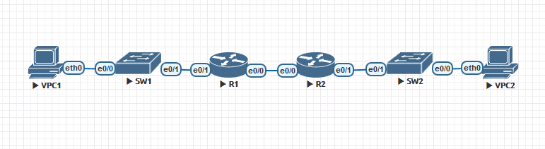

# Configure DHCPv6



## R1 configuration
```
Router>enable
Router#conf t
Router#hostname r1
r1(config)#ipv6 unicast-routing
r1(config)#int eth 0/0
r1(config-if)#Description R1 to R2 IPv6 comm
r1(config-if)#ipv6 address 2001:db8:acad:2::1/64 eui-64
r1(config-if)#ipv6 address fe80::1 link-local
r1(config-if)#no shut
r1(config-if)#int eth 0/1
r1(config-if)#Description R1 to SW1 IPv6 comm
r1(config-if)#ipv6 address 2001:db8:acad:1::1/64 eui-64
r1(config-if)#ipv6 address fe80::1 link-local
r1(config-if)#no shut
r1(config-subif)#end
r1#copy running-config startup-config
```
```
r1#show ipv6 int e0/0
Ethernet0/0 is up, line protocol is up
  IPv6 is enabled, link-local address is FE80::1
  No Virtual link-local address(es):
  Description: R1 to R2 comm
  Global unicast address(es):
    2001:DB8:ACAD:2::1, subnet is 2001:DB8:ACAD:2::/64
    2001:DB8:ACAD:2::1, subnet is 2001:DB8:ACAD:2::/64 [EUI/TEN]
  Joined group address(es):
    FF02::1
    FF02::2
    FF02::1:FF00:1
  MTU is 1500 bytes
  ICMP error messages limited to one every 100 milliseconds
  ICMP redirects are enabled
  ICMP unreachables are sent
  ND DAD is enabled, number of DAD attempts: 1
  ND reachable time is 30000 milliseconds (using 30000)
  ND advertised reachable time is 0 (unspecified)
  ND advertised retransmit interval is 0 (unspecified)
  ND router advertisements are sent every 200 seconds
  ND router advertisements live for 1800 seconds
  ND advertised default router preference is Medium
  Hosts use stateless autoconfig for addresses.

r1#show ipv6 int e0/1
Ethernet0/1 is up, line protocol is up
  IPv6 is enabled, link-local address is FE80::1
  No Virtual link-local address(es):
  Description: R1 to SW1 comm
  Global unicast address(es):
    2001:DB8:ACAD:1::1, subnet is 2001:DB8:ACAD:1::/64
    2001:DB8:ACAD:1::1, subnet is 2001:DB8:ACAD:1::/64 [EUI/TEN]
  Joined group address(es):
    FF02::1
    FF02::2
    FF02::1:FF00:1
  MTU is 1500 bytes
  ICMP error messages limited to one every 100 milliseconds
  ICMP redirects are enabled
  ICMP unreachables are sent
  ND DAD is enabled, number of DAD attempts: 1
  ND reachable time is 30000 milliseconds (using 30000)
  ND advertised reachable time is 0 (unspecified)
  ND advertised retransmit interval is 0 (unspecified)
  ND router advertisements are sent every 200 seconds
  ND router advertisements live for 1800 seconds
  ND advertised default router preference is Medium
  Hosts use stateless autoconfig for addresses.
```
## R1 adding IPv6 static route
```
r1#conf t
r1(config)#ipv6 route 2001:db8:acad:3::1/64 2001:db8:acad:2::2
```
```
r1#show ipv6 route
IPv6 Routing Table - default - 6 entries
Codes: C - Connected, L - Local, S - Static, U - Per-user Static route
       B - BGP, HA - Home Agent, MR - Mobile Router, R - RIP
       H - NHRP, I1 - ISIS L1, I2 - ISIS L2, IA - ISIS interarea
       IS - ISIS summary, D - EIGRP, EX - EIGRP external, NM - NEMO
       ND - ND Default, NDp - ND Prefix, DCE - Destination, NDr - Redirect
       O - OSPF Intra, OI - OSPF Inter, OE1 - OSPF ext 1, OE2 - OSPF ext 2
       ON1 - OSPF NSSA ext 1, ON2 - OSPF NSSA ext 2, la - LISP alt
       lr - LISP site-registrations, ld - LISP dyn-eid, a - Application
C   2001:DB8:ACAD:1::/64 [0/0]
     via Ethernet0/1, directly connected
L   2001:DB8:ACAD:1::1/128 [0/0]
     via Ethernet0/1, receive
C   2001:DB8:ACAD:2::/64 [0/0]
     via Ethernet0/0, directly connected
L   2001:DB8:ACAD:2::1/128 [0/0]
     via Ethernet0/0, receive
S   2001:DB8:ACAD:3::/64 [1/0]
     via 2001:DB8:ACAD:2::2
L   FF00::/8 [0/0]
     via Null0, receive
```
## R2 configuration
```
Router>enable
Router#conf t
Router#hostname r2
r2(config)#ipv6 unicast-routing
r2(config)#int eth 0/0
r2(config-if)#Description R2 to R1 IPv6 comm
r2(config-if)#ipv6 address 2001:db8:acad:2::2/64 eui-64
r2(config-if)#ipv6 address fe80::2 link-local
r2(config-if)#no shut
r2(config-if)#int eth 0/1
r2(config-if)#Description R2 to SW2 IPv6 comm
r2(config-if)#ipv6 address 2001:db8:acad:3::1/64 eui-64
r2(config-if)#ipv6 address fe80::1 link-local
r2(config-if)#no shut
r2(config-if)#end
r2#copy running-config startup-config
```
```
r2#show ipv6 int e0/0
Ethernet0/0 is up, line protocol is up
  IPv6 is enabled, link-local address is FE80::2
  No Virtual link-local address(es):
  Description: R2 to R1 comm
  Global unicast address(es):
    2001:DB8:ACAD:2::2, subnet is 2001:DB8:ACAD:2::/64
    2001:DB8:ACAD:2::2, subnet is 2001:DB8:ACAD:2::/64 [EUI/TEN]
  Joined group address(es):
    FF02::1
    FF02::2
    FF02::1:FF00:2
  MTU is 1500 bytes
  ICMP error messages limited to one every 100 milliseconds
  ICMP redirects are enabled
  ICMP unreachables are sent
  ND DAD is enabled, number of DAD attempts: 1
  ND reachable time is 30000 milliseconds (using 30000)
  ND advertised reachable time is 0 (unspecified)
  ND advertised retransmit interval is 0 (unspecified)
  ND router advertisements are sent every 200 seconds
  ND router advertisements live for 1800 seconds
  ND advertised default router preference is Medium
  Hosts use stateless autoconfig for addresses.

r2#show ipv6 int e0/1
Ethernet0/1 is up, line protocol is up
  IPv6 is enabled, link-local address is FE80::1
  No Virtual link-local address(es):
  Description: R2 to SW2 comm
  Global unicast address(es):
    2001:DB8:ACAD:3::1, subnet is 2001:DB8:ACAD:3::/64
    2001:DB8:ACAD:3::1, subnet is 2001:DB8:ACAD:3::/64 [EUI/TEN]
  Joined group address(es):
    FF02::1
    FF02::2
    FF02::1:FF00:1
  MTU is 1500 bytes
  ICMP error messages limited to one every 100 milliseconds
  ICMP redirects are enabled
  ICMP unreachables are sent
  ND DAD is enabled, number of DAD attempts: 1
  ND reachable time is 30000 milliseconds (using 30000)
  ND advertised reachable time is 0 (unspecified)
  ND advertised retransmit interval is 0 (unspecified)
  ND router advertisements are sent every 200 seconds
  ND router advertisements live for 1800 seconds
  ND advertised default router preference is Medium
  Hosts use stateless autoconfig for addresses.
```

## R2 adding static route
```
r2#conf t
r2(config)#ipv6 route 2001:db8:acad:1::1/64 2001:db8:acad:2::1
```
```
r2#show ipv6 route
IPv6 Routing Table - default - 6 entries
Codes: C - Connected, L - Local, S - Static, U - Per-user Static route
       B - BGP, HA - Home Agent, MR - Mobile Router, R - RIP
       H - NHRP, I1 - ISIS L1, I2 - ISIS L2, IA - ISIS interarea
       IS - ISIS summary, D - EIGRP, EX - EIGRP external, NM - NEMO
       ND - ND Default, NDp - ND Prefix, DCE - Destination, NDr - Redirect
       O - OSPF Intra, OI - OSPF Inter, OE1 - OSPF ext 1, OE2 - OSPF ext 2
       ON1 - OSPF NSSA ext 1, ON2 - OSPF NSSA ext 2, la - LISP alt
       lr - LISP site-registrations, ld - LISP dyn-eid, a - Application
S   2001:DB8:ACAD:1::/64 [1/0]
     via 2001:DB8:ACAD:2::1
C   2001:DB8:ACAD:2::/64 [0/0]
     via Ethernet0/0, directly connected
L   2001:DB8:ACAD:2::2/128 [0/0]
     via Ethernet0/0, receive
C   2001:DB8:ACAD:3::/64 [0/0]
     via Ethernet0/1, directly connected
L   2001:DB8:ACAD:3::1/128 [0/0]
     via Ethernet0/1, receive
L   FF00::/8 [0/0]
     via Null0, receive
```

## Ping IPv6 from R1 to R2
```
r1#ping ipv6 2001:db8:acad:3::1
Type escape sequence to abort.
Sending 5, 100-byte ICMP Echos to 2001:DB8:ACAD:3::1, timeout is 2 seconds:
!!!!!
Success rate is 100 percent (5/5), round-trip min/avg/max = 1/2/4 ms
```

## VPC1 IPv6 SLAAC configuration
```
VPCS> ip auto
GLOBAL SCOPE      : 2001:db8:acad:3:2050:79ff:fe66:6806/64
ROUTER LINK-LAYER : aa:bb:cc:00:20:10

VPCS> save vpc1
```

## VPC2 IPv6 SLAAC configuration
```
VPCS> ip auto
GLOBAL SCOPE      : 2001:db8:acad:3:3469:88fe:ee12:8043/64
ROUTER LINK-LAYER : aa:bb:cc:00:20:10

VPCS> save vpc2
```

## R1 stateless DHCPv6 configuration additions to provide domain-name and dns-server's IPv6 adress for VPC1
```
r1#conf t
r1(config)#ipv6 dhcp pool R1statelessDHCPv6
r1(config-dhcpv6)#dns-server 2001:db8:acad::254
r1(config-dhcpv6)#domain-name stateless.net
r1(config-dhcpv6)#int e0/1
r1(config-if)#ipv6 nd other-config-flag
r1(config-if)#ipv6 dhcp server R1statelessDHCPv6
r1(config-if)#end
r1#copy running-config startup-config
```

## R1 stateful DHCPv6 server for VPC1 and VPC2
```
r1#conf t
r1(config)#ipv6 dhcp pool R2statefulDHCPv6
r1(config-dhcpv6)#address prefix 2001:db8:acad:3:aaa::/80
r1(config-dhcpv6)#dns-server 2001:db8:acad::254
r1(config-dhcpv6)#domain-name stateful.net
r1(config-dhcpv6)#int eth 0/1
r1(config-if)#ipv6 dhcp server R2statefulDHCPv6
r1(config-if)#end
r1#copy running-config startup-config
```

## R2 stateful DHCPv6 relay for VPC2
```
r2#conf t
r2(config)#int eth 0/1
r2(config-if)#ipv6 nd managed-config-flag
r2(config-if)#ipv6 dhcp relay destination 2001:db8:acad:2::1 e0/0
```