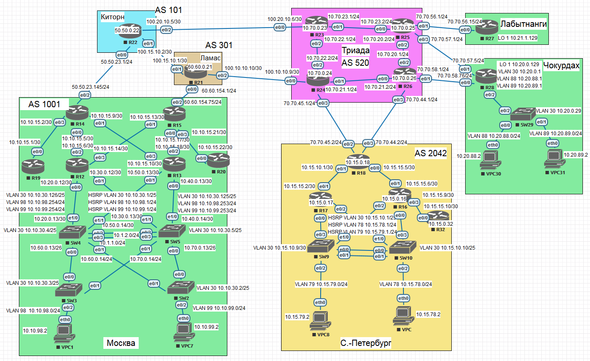

# IPv4/6



## Address space planning

### Branch Moscow AS1001

|              |            | IPv4          |                 |            | IPv6                   | Prefix IPv6  |                     |               |
|--------------|------------|---------------|-----------------|------------|------------------------|--------------|---------------------|---------------|
| 10.10.0.0/20 | 10.10.0.1  | 10.10.15.254  |                 |            | 2001:1001::0           | /48          |                     |               |
| VLAN 30      | Management | 10.10.30.0/25 |                 |            | 2001:1001::0           | /52          |                     |               |
| VLAN 98      | VPC1       | 10.10.98.0/24 |                 |            | 2001:1001:0:1000::0    | /52          |                     |               |
| VLAN 99      | VPC7       | 10.10.99.0/24 |                 |            | 2001:1001:0:2000::0    | /52          |                     |               |
                                                                                                                                                
| Hardware     | Interface  | IPv4          | Subnet mask     | Gateway    | IPv6                   | Prefix IPv6  | Gateway IPv6        | LLA           |
|--------------|------------|---------------|-----------------|------------|------------------------|--------------|---------------------|---------------|
| R14          | Lo1        | 10.10.0.14    | 255.255.255.255 |            | 2001:1001:1000::14     | /128         |                     | FE80::1400/10 |
| R14          | e0/2       | 50.50.23.145  | 255.255.255.0   |            | 2001:5050:0:5::2       | /64          |                     | FE80::1400/10 |
| R14          | e0/0       | 10.10.15.5    | 255.255.255.252 |            | 2001:1001:0:2::1       | /64          |                     | FE80::1400/10 |
| R14          | e0/1       | 10.10.15.9    | 255.255.255.252 |            | 2001:1001:0:3::1       | /64          |                     | FE80::1400/10 |
| R14          | e0/3       | 10.10.15.2    | 255.255.255.252 |            | 2001:1001:0:1::1       | /64          |                     | FE80::1400/10 |
| R15          | Lo1        | 10.10.0.15    | 255.255.255.255 |            | 2001:1001:1000::15     | /128         |                     | FE80::1500/10 |
| R15          | e0/2       | 60.60.154.75  | 255.255.255.0   |            | 2001:6060:0:3::2       | /64          |                     | FE80::1500/10 |
| R15          | e0/0       | 10.10.15.17   | 255.255.255.252 |            | 2001:1001:0:5::1       | /64          |                     | FE80::1500/10 |
| R15          | e0/1       | 10.10.15.13   | 255.255.255.252 |            | 2001:1001:0:4::1       | /64          |                     | FE80::1500/10 |
| R15          | e0/3       | 10.10.15.21   | 255.255.255.252 |            | 2001:1001:0:6::1       | /64          |                     | FE80::1500/10 |
| R12          | Lo1        | 10.10.0.12    | 255.255.255.255 |            | 2001:1001:1000::12     | /128         |                     | FE80::1200/10 |
| R12          | e0/2       | 10.10.15.6    | 255.255.255.252 |            | 2001:1001:0:2::2       | /64          |                     | FE80::1200/10 |
| R12          | e0/3       | 10.10.15.14   | 255.255.255.252 |            | 2001:1001:0:4::2       | /64          |                     | FE80::1200/10 |
| R12          | VLAN98     | 10.10.98.254  | 255.255.255.0   |            | 2001:1001:0:1000::1000 | /64          |                     | FE80::1200/10 |
| R12          | VLAN99     | 10.10.99.254  | 255.255.255.0   |            | 2001:1001:0:2000::1000 | /64          |                     | FE80::1200/10 |
| R12          | VLAN30     | 10.10.30.126  | 255.255.255.128 |            | 2001:1001::1000        | /64          |                     | FE80::1200/10 |
| R13          | Lo1        | 10.10.0.13    | 255.255.255.255 |            | 2001:1001:1000::13     | /128         |                     | FE80::1300/10 |
| R13          | e0/2       | 10.10.15.18   | 255.255.255.252 |            | 2001:1001:0:5::2       | /64          |                     | FE80::1300/10 |
| R13          | e0/3       | 10.10.15.10   | 255.255.255.252 |            | 2001:1001:0:3::2       | /64          |                     | FE80::1300/10 |
| R13          | VLAN98     | 10.10.98.253  | 255.255.255.0   |            | 2001:1001:0:1000::1001 | /64          |                     | FE80::1300/10 |
| R13          | VLAN99     | 10.10.99.253  | 255.255.255.0   |            | 2001:1001:0:2000::1001 | /64          |                     | FE80::1300/10 |
| R13          | VLAN30     | 10.10.30.125  | 255.255.255.128 |            | 2001:1001::1001        | /64          |                     | FE80::1300/10 |
| R19          | Lo1        | 10.10.0.19    | 255.255.255.255 |            | 2001:1001:1000::19     | /128         |                     | FE80::1900/10 |
| R19          | e0/0       | 10.10.15.1    | 255.255.255.252 |            | 2001:1001:0:1::2       | /64          |                     | FE80::1900/10 |
| R20          | Lo1        | 10.10.0.20    | 255.255.255.255 |            | 2001:1001:1000::20     | /128         |                     | FE80::2000/10 |
| R20          | e0/0       | 10.10.15.22   | 255.255.255.252 |            | 2001:1001:0:6::2       | /64          |                     | FE80::2000/10 |
| SW3          | VLAN30     | 10.10.30.3    | 255.255.255.128 |            | 2001:1001::3           | /64          | 2001:1001::1        | FE80::1403/10 |
| SW2          | VLAN30     | 10.10.30.2    | 255.255.255.128 |            | 2001:1001::2           | /64          | 2001:1001::1        | FE80::1403/10 |
| SW4          | VLAN30     | 10.10.30.4    | 255.255.255.128 |            | 2001:1001::4           | /64          | 2001:1001::1        | FE80::1403/10 |
| SW5          | VLAN30     | 10.10.30.5    | 255.255.255.128 |            | 2001:1001::5           | /64          | 2001:1001::1        | FE80::1403/10 |
| VPC1         | eth0       | 10.10.98.2    | 255.255.255.0   | 10.10.98.1 | 2001:1001:0:1000::2    | /64          | 2001:1001:0:1000::1 | FE80::1403/10 |
| VPC7         | eth0       | 10.10.99.2    | 255.255.255.0   | 10.10.99.1 | 2001:1001:0:2000::2    | /64          | 2001:1001:0:2000::1 | FE80::1403/10 |

### Branch Saint Petersburg AS2042

|              |                 | IPv4          |                 |            | IPv6                   | Prefix IPv6  |                     |               |
|--------------|-----------------|---------------|-----------------|------------|------------------------|--------------|---------------------|---------------|
| 10.15.0.0/20 | 10.15.0.1       | 10.15.15.254  |                 |            | 2001:2042::0           | /48          |                     |               |
| VLAN 30      | Management      | 10.15.10.0/25 |                 |            | 2001:2042::0           | /52          |                     |               |
| VLAN 78      | VPC             | 10.15.78.0/24 |                 |            | 2001:2042:0:1000::0    | /52          |                     |               |
| VLAN 79      | VPC8            | 10.15.79.0/24 |                 |            | 2001:2042:0:2000::0    | /52          |                     |               |

| Hardware     | Interface       | IPv4          | Subnet mask     | Gateway    | IPv6                   | Prefix IPv6  | Gateway IPv6        | LLA           |
|--------------|-----------------|---------------|-----------------|------------|------------------------|--------------|---------------------|---------------|
| R18          | Lo1             | 10.15.0.18    | 255.255.255.255 |            | 2001:2042:1000::14     | /128         |                     | FE80::2400/10 |
| R18          | e0/2            | 60.60.154.75  | 255.255.255.0   |            | 2001:6060:0:5::2       | /64          |                     | FE80::2400/10 |
| R18          | e0/0            | 10.15.15.5    | 255.255.255.252 |            | 2001:2042:0:2::1       | /64          |                     | FE80::2400/10 |
| R18          | e0/1            | 10.15.15.1    | 255.255.255.252 |            | 2001:2042:0:3::1       | /64          |                     | FE80::2400/10 |
| R18          | e0/3            | 10.15.15.21   | 255.255.255.252 |            | 2001:2042:0:1::1       | /64          |                     | FE80::2400/10 |
| R17          | Lo1             | 10.15.0.17    | 255.255.255.255 |            | 2001:2042:1000::17     | /128         |                     | FE80::2500/10 |
| R17          | e0/1            | 10.15.15.2    | 255.255.255.252 |            | 2001:2042:0:15::2      | /64          |                     | FE80::2200/10 |
| R17          | VLAN78          | 10.15.78.254  | 255.255.255.0   |            | 2001:2042:0:1000::1000 | /64          |                     | FE80::2200/10 |
| R17          | VLAN79          | 10.15.79.254  | 255.255.255.0   |            | 2001:2042:0:2000::1000 | /64          |                     | FE80::2200/10 |
| R17          | VLAN30          | 10.15.10.126  | 255.255.255.128 |            | 2001:2042::1000        | /64          |                     | FE80::2200/10 |
| R16          | Lo1             | 10.15.0.16    | 255.255.255.255 |            | 2001:2042:1000::16     | /128         |                     | FE80::2300/10 |
| R16          | e0/1            | 10.15.15.6    | 255.255.255.252 |            | 2001:2042:0:5::2       | /64          |                     | FE80::2300/10 |
| R16          | e0/3            | 10.15.15.9    | 255.255.255.252 |            | 2001:2042:0:3::2       | /64          |                     | FE80::2300/10 |
| R16          | VLAN78          | 10.15.78.253  | 255.255.255.0   |            | 2001:2042:0:1000::1001 | /64          |                     | FE80::2300/10 |
| R16          | VLAN79          | 10.15.79.253  | 255.255.255.0   |            | 2001:2042:0:2000::1001 | /64          |                     | FE80::2300/10 |
| R16          | VLAN30          | 10.15.10.125  | 255.255.255.128 |            | 2001:2042::1001        | /64          |                     | FE80::2300/10 |
| R32          | Lo1             | 10.15.0.32    | 255.255.255.255 |            | 2001:2042:1000::32     | /128         |                     | FE80::2900/10 |
| R32          | e0/0            | 10.15.15.10   | 255.255.255.252 |            | 2001:2042:0:1::2       | /64          |                     | FE80::2900/10 |
| SW9          | VLAN30          | 10.15.10.9    | 255.255.255.128 |            | 2001:2042::2           | /64          | 2001:2042::1        | FE80::2403/10 |
| SW10         | VLAN30          | 10.15.10.10   | 255.255.255.128 |            | 2001:2042::3           | /64          | 2001:2042::1        | FE80::2403/10 |
| VPC          | eth0            | 10.15.78.2    | 255.255.255.0   | 10.15.78.1 | 2001:2042:0:1000::2    | /64          | 2001:1001:0:1000::1 | FE80::2403/10 |
| VPC8         | eth0            | 10.15.79.2    | 255.255.255.0   | 10.15.79.1 | 2001:2042:0:2000::2    | /64          | 2001:1001:0:2000::1 | FE80::2403/10 |

### Branch Labytnagy

|              |            |             |                 |      | IPv6             | Prefix IPv6  |
|--------------|------------|-------------|-----------------|------|------------------|--------------|
| 10.21.0.0/22 |            |             |                 |      | 2001:1021::0     | /64          |

| Hardware     | Interface  | IPv4        | Subnet mask     | GW   | IPv6             | Prefix IPv6  |
|--------------|------------|-------------|-----------------|------|------------------|--------------|
| R27          | Lo1        | 10.21.1.129 | 255.255.255.255 |      |                  |              |
| R27          | e0/0       | 70.70.56.15 | 255.255.255.0   |      | 2001:7070:0:1::2 | /64          |
| R27          | VLAN30     | 10.21.1.1   | 255.255.255.127 |      | 2001:1021::1     | /64          |

### Branch Chokyrdak

|              |            | IPv4         | Subnet mask     |           | IPv6                  | Prefix IPv6  |
|--------------|------------|--------------|-----------------|-----------|-----------------------|--------------|
| 10.20.0.0/22 | 10.20.0.1  | 10.20.3.254  |                 |           | 2001:1020::0          | /64          |
| VLAN         |            |              |                 |           |                       |              |
| VLAN 30      | Management | 10.20.0.0/25 |                 |           | 2001:1020::0          | /66          |
| VLAN 88      | VPC30      | 10.20.88.0/24|                 |           | 2001:1020:0:0:4000::0 | /66          |
| VLAN 89      | VPC31      | 10.20.89.0/24|                 |           | 2001:1020:0:0:8000::0 | /66          |

| Hardware     | Interface  | IPv4         | Subnet mask     | GW        | IPv6                  | Prefix  IPv6 |
|--------------|------------|--------------|-----------------|-----------|-----------------------|--------------|
| R28          | Lo1        | 10.20.0.129  | 255.255.255.255 |           |                       |              |
| R28          | e0/0       | 70.70.58.76  | 255.255.255.0   |           | 2001:7070:0:5::2      | /64          |
| R28          | e0/1       | 70.70.57.5   | 255.255.255.0   |           | 2001:7070:0:3::2      | /64          |
| R28          | VLAN30     | 10.20.0.1    | 255.255.255.128 |           | 2001:1020::1          | /66          |
| R28          | VLAN88     | 10.20.88.1   | 255.255.255.0   |           | 2001:1020:0:0:4000::1 | /66          |
| R28          | VLAN89     | 10.20.89.1   | 255.255.255.0   |           | 2001:1020:0:0:8000::1 | /66          |
| SW29         | VLAN30     | 10.20.0.29   | 255.255.255.128 |           | 2001:1020::29         | /66          |
| VPC30        | eth0       | 10.20.2.2    | 255.255.255.0   | 10.20.88.1| 2001:1020:0:0:4000::2 | /66          |
| VPC31        | eth0       | 10.20.3.2    | 255.255.255.0   | 10.20.89.1| 2001:1020:0:0:8000::2 | /66          |

### ISP Triada AS520

|              |                 |                |                 |      |
|--------------|-----------------|----------------|-----------------|------|
| 70.70.0.0/16 | 70.70.0.0       | 70.70.255.255  |                 |      |

| Hardware     | Interface       | IPv4           | Subnet mask     | GW   |
|--------------|-----------------|----------------|-----------------|------|
| R23          | Lo1             | 10.70.0.23     | 255.255.255.255 |      |
| R23          | e0/0            | 100.20.10.6    | 255.255.255.252 |      |
| R23          | e0/1            | 10.70.23.1     | 255.255.255.0   |      |
| R23          | e0/2            | 10.70.22.1     | 255.255.255.252 |      |
| R24          | Lo1             | 10.70.0.24     | 255.255.255.255 |      |
| R24          | e0/0            | 100.10.10.9    | 255.255.255.252 |      |
| R24          | e0/1            | 10.70.21.1     | 255.255.255.0   |      |
| R24          | e0/2            | 10.70.22.2     | 255.255.255.0   |      |
| R24          | e0/3            | 10.70.45.1     | 255.255.255.0   |      |
| R25          | Lo1             | 10.70.0.25     | 255.255.255.255 |      |
| R25          | e0/0            | 10.70.23.2     | 255.255.255.0   |      |
| R25          | e0/1            | 70.70.56.1     | 255.255.255.0   |      |
| R25          | e0/2            | 10.70.20.2     | 255.255.255.0   |      |
| R25          | e0/3            | 70.70.57.1     | 255.255.255.0   |      |
| R26          | Lo1             | 10.70.0.26     | 255.255.255.255 |      |
| R26          | e0/0            | 10.70.21.2     | 255.255.255.0   |      |
| R26          | e0/1            | 70.70.58.1     | 255.255.255.0   |      |
| R26          | e0/2            | 10.70.20.1     | 255.255.255.0   |      |
| R26          | e0/3            | 70.70.44.1     | 255.255.255.0   |      |

### ISP Kitorn AS101

| Hardware     | Interface       | IPv4           | Subnet Mask     | GW   |
|--------------|-----------------|----------------|-----------------|------|
| 50.50.0.0/16 | 50.50.0.0       | 50.50.255.255  |                 |      |
| R22          | Lo1             | 50.50.0.22     | 255.255.255.255 |      |
| R22          | e0/0            | 50.50.23.1     | 255.255.255.0   |      |
| R22          | e0/1            | 100.15.10.2    | 255.255.255.252 |      |
| R22          | e0/2            | 100.20.10.5    | 255.255.255.252 |      |

### ISP Lamas AS301

| Hardware     | Interface       | IPv4           | Subnet Mask     | GW   |
|--------------|-----------------|----------------|-----------------|------|
| 60.60.0.0/16 | 60.60.0.0       | 60.60.255.255  |                 |      |
| R21          | Lo1             | 60.60.0.21     | 255.255.255.255 |      |
| R21          | e0/0            | 60.60.154.1    | 255.255.255.0   |      |
| R21          | e0/1            | 100.15.10.1    | 255.255.255.252 |      |
| R21          | e0/2            | 100.10.10.10   | 255.255.255.252 |      |

## VPCxx IP configuration sample
```
VPCS> ip 10.xx.xx.2/24 10.xx.xx.1
VPCS> save vpc
```
### SWxx trunk to SWxx sample
```
swxx#conf t
swxx(config)#interface e0/x
swxx(config-if)#Switchport trunk encapsulation dot1q
swxx(config-if)#Switchport mode trunk
swxx(config-if)#Switchport trunk native vlan 30
swxx(config-if)#Switchport trunk allowed vlan xx,xx,30
swxx(config-if)#no shut
swxx(config-if)#end
```
### R14 setup sample
```
conf t
 ipv6 unicast-routing
!
 interface Ethernet0/0
  description "R14 to R12"
  ip address 10.10.15.5 255.255.255.252
  ipv6 address FE80::1400:10 link-local
  ipv6 address 2001:1001:0:2::1/64
  ipv6 enable
  no shutdown
  exit
!
 interface Ethernet0/1
  description "R14 to R13"
  ip address 10.10.15.9 255.255.255.252
  ipv6 address FE80::1400:10 link-local
  ipv6 address 2001:1001:0:3::1/64
  ipv6 enable
  no shutdown
  exit
!
 interface Ethernet0/2
  description "to Kitorn AS101"
  ip address 50.50.23.145 255.255.255.0
  ipv6 address FE80::1400:10 link-local
  ipv6 address 2001:5050:0:5::2/64
  ipv6 enable
  no shutdown
  exit
!
 interface Ethernet0/3
  description "R14 to R19"
  ip address 10.10.15.2 255.255.255.252
  ipv6 address FE80::1400:10 link-local
  ipv6 address 2001:1001:0:1::1/64
  ipv6 enable
  no shutdown
  exit exit
```