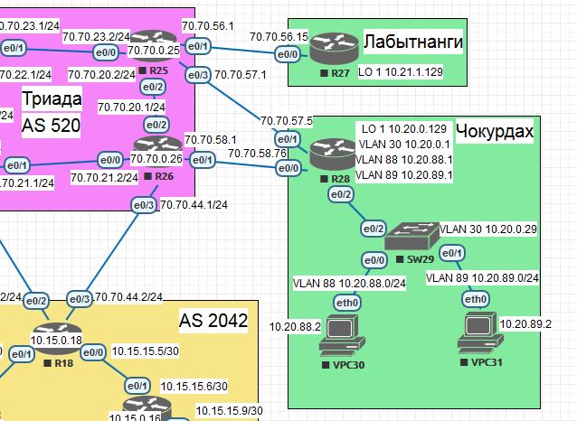

# Policy based routing (PBR)



## Chokyrdak
Has two LANs: 10.20.88.0/24 and 10.20.89.0/24 with two Up-Links to AS520 "Triada" ISP directly from R28 e0/0 70.70.58.76/24 and e0/1 70.70.57.5/24.
IP SLA will be configured on R28 to monitor link state.

### PBR setup on R28
```
R28(config)# ip access-list standard VLAN88
R28(config)# permit 10.20.88.0 0.0.0.255
R28(config)# ip access-list standard VLAN89
R28(config)# permit 10.20.89.0 0.0.0.255

R28(config)# ip sla auto discovery
R28(config)# ip sla 1
R28(config)# icmp-echo 70.70.58.1 source-interface Ethernet0/0
R28(config)# frequency 15
R28(config)# ip sla schedule 1 life forever start-time now
R28(config)# ip sla 2
R28(config)# icmp-echo 70.70.57.1 source-interface Ethernet0/1
R28(config)# frequency 15
R28(config)# ip sla schedule 2 life forever start-time now

R28(config)# route-map PBR1 permit 10
R28(config)# match ip address VLAN88
R28(config)# set ip next-hop verify-availability 70.70.58.1 1 track 1
R28(config)# set ip next-hop verify-availability 70.70.57.1 2 track 2
R28(config)# route-map PBR1 permit 20
R28(config)# match ip address VLAN89
R28(config)# set ip next-hop verify-availability 70.70.57.1 2 track 2
R28(config)# set ip next-hop verify-availability 70.70.58.1 2 track 1

R28(config)# interface Ethernet0/2.10
R28(config)# ip policy route-map PBR1

R28(config)# interface Ethernet0/2.11
R28(config)# ip policy route-map PBR1
```

### PBR testing
To test R28 config above it is necessary to add routes to 10.20.88.0/24 and 10.20.89.0/24 on R25 and R26 accordingly. 

```
R25(config)#ip route 10.20.88.0 255.255.255.0 70.70.57.5
R26(config)#ip route 10.20.89.0 255.255.255.0 70.70.58.76
```
### VPC30
```
VPCS> trace 1.1.1.1
trace to 1.1.1.1, 8 hops max, press Ctrl+C to stop
 1   10.20.88.1   0.489 ms  0.413 ms  0.355 ms
 2   70.70.58.1   0.941 ms  0.537 ms  0.424 ms
 3   *70.70.58.1   0.624 ms (ICMP type:3, code:1, Destination host unreachable)  
*
```
### VPC31
```
VPCS> trace 1.1.1.1
trace to 1.1.1.1, 8 hops max, press Ctrl+C to stop
 1   10.20.89.1   0.894 ms  0.630 ms  0.585 ms
 2   70.70.57.1   1.441 ms  0.707 ms  0.650 ms
 3   *70.70.57.1   0.694 ms (ICMP type:3, code:1, Destination host unreachable)  
*
```
## Up-Link e0/0 is down

### VPC30
```
VPCS> trace 1.1.1.1
trace to 1.1.1.1, 8 hops max, press Ctrl+C to stop
 1   10.20.88.1   0.924 ms  0.399 ms  0.374 ms
 2   70.70.57.1   1.049 ms  0.611 ms  0.675 ms
 3   *70.70.57.1   0.595 ms (ICMP type:3, code:1, Destination host unreachable) 
*
```
### VPC31
```
VPCS> trace 1.1.1.1
trace to 1.1.1.1, 8 hops max, press Ctrl+C to stop
 1   10.20.89.1   0.591 ms  0.447 ms  0.474 ms
 2   70.70.57.1   0.676 ms  0.634 ms  1.003 ms
 3   *70.70.57.1   0.539 ms (ICMP type:3, code:1, Destination host unreachable)  
*
```
## Up-Link e0/1 is down

### VPC30
```
VPCS> trace 1.1.1.1
trace to 1.1.1.1, 8 hops max, press Ctrl+C to stop
 1   10.20.88.1   0.805 ms  0.488 ms  0.435 ms
 2   70.70.58.1   1.158 ms  0.644 ms  0.558 ms
 3   *70.70.58.1   0.625 ms (ICMP type:3, code:1, Destination host unreachable)  
*
```
### VPC31
```
VPCS> trace 1.1.1.1
trace to 1.1.1.1, 8 hops max, press Ctrl+C to stop
 1   10.20.89.1   0.485 ms  0.426 ms  0.443 ms
 2   70.70.58.1   0.741 ms  0.494 ms  0.563 ms
 3   *70.70.58.1   0.535 ms (ICMP type:3, code:1, Destination host unreachable)  
*
```
### Labytnagy

Will be routed trough R25.

```
R27(config)# ip route 0.0.0.0 0.0.0.0 70.70.56.1
```
