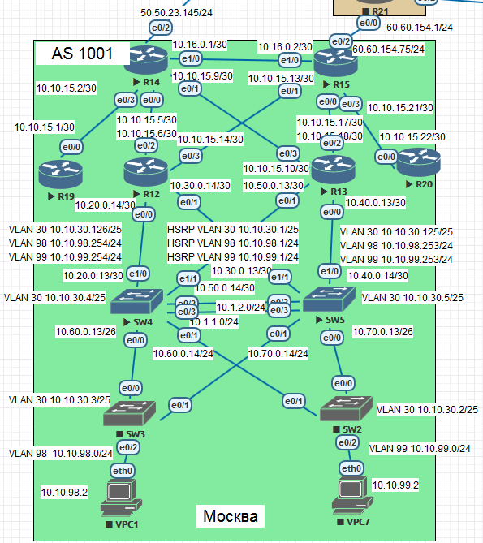

# OSPF filtering



## Description

- R14 and R15 in area 0 - backbone;
- R12 and R13 in area 10 must have all routing plus default route;
- R19 in area 101 and get only default route;
- R20 in area 102 and get all of the routes except routes to area 101;
- SW4 and SW5 (area 10) are also participate in routing, so ospf process will be running on both switches

### OSPF on R14 and R15 (area 0)
```
router ospf 1
 router-id 14.14.14.14         
 area 10 stub
 area 101 stub no-summary
 passive-interface Ethernet0/2
 network 14.14.14.14 0.0.0.0 area 0
 network 10.10.15.0 0.0.0.3 area 101
 network 10.10.15.4 0.0.0.3 area 10
 network 10.10.15.8 0.0.0.3 area 10
```
```
router ospf 1
 router-id 15.15.15.15
 area 10 stub
 area 102 filter-list prefix area102dead in
 network 10.10.15.0 0.0.0.3 area 10
 network 10.10.15.12 0.0.0.3 area 10
 network 10.10.15.20 0.0.0.3 area 102
 network 60.60.154.75 0.0.0.0 area 0
```

### R14 routing table
```
R14#show ip route ospf
Codes: L - local, C - connected, S - static, R - RIP, M - mobile, B - BGP
       D - EIGRP, EX - EIGRP external, O - OSPF, IA - OSPF inter area
       N1 - OSPF NSSA external type 1, N2 - OSPF NSSA external type 2
       E1 - OSPF external type 1, E2 - OSPF external type 2
       i - IS-IS, su - IS-IS summary, L1 - IS-IS level-1, L2 - IS-IS level-2
       ia - IS-IS inter area, * - candidate default, U - per-user static route
       o - ODR, P - periodic downloaded static route, H - NHRP, l - LISP
       + - replicated route, % - next hop override

Gateway of last resort is 50.50.23.1 to network 0.0.0.0

      10.0.0.0/8 is variably subnetted, 12 subnets, 3 masks
O        10.10.15.12/30 [110/20] via 10.10.15.6, 00:57:25, Ethernet0/0
O        10.10.15.16/30 [110/20] via 10.10.15.10, 00:46:19, Ethernet0/1
O        10.20.0.0/24 [110/20] via 10.10.15.6, 00:58:43, Ethernet0/0
O        10.30.0.0/24 [110/20] via 10.10.15.6, 00:58:43, Ethernet0/0
O        10.40.0.0/24 [110/20] via 10.10.15.10, 00:46:19, Ethernet0/1
O        10.50.0.0/24 [110/20] via 10.10.15.10, 00:46:19, Ethernet0/1

```
### R15 routing table
```
R15#show ip route ospf
Codes: L - local, C - connected, S - static, R - RIP, M - mobile, B - BGP
       D - EIGRP, EX - EIGRP external, O - OSPF, IA - OSPF inter area
       N1 - OSPF NSSA external type 1, N2 - OSPF NSSA external type 2
       E1 - OSPF external type 1, E2 - OSPF external type 2
       i - IS-IS, su - IS-IS summary, L1 - IS-IS level-1, L2 - IS-IS level-2
       ia - IS-IS inter area, * - candidate default, U - per-user static route
       o - ODR, P - periodic downloaded static route, H - NHRP, l - LISP
       + - replicated route, % - next hop override

Gateway of last resort is 60.60.154.1 to network 0.0.0.0

      10.0.0.0/8 is variably subnetted, 13 subnets, 3 masks
O IA     10.10.15.0/30 [110/30] via 10.10.15.14, 00:01:05, Ethernet0/1
O        10.10.15.4/30 [110/20] via 10.10.15.14, 00:01:05, Ethernet0/1
O        10.10.15.8/30 [110/30] via 10.10.15.14, 00:01:05, Ethernet0/1
O        10.20.0.0/24 [110/20] via 10.10.15.14, 00:01:05, Ethernet0/1
O        10.30.0.0/24 [110/20] via 10.10.15.14, 00:01:05, Ethernet0/1
O        10.40.0.0/24 [110/40] via 10.10.15.14, 00:01:05, Ethernet0/1
O        10.50.0.0/24 [110/40] via 10.10.15.14, 00:01:05, Ethernet0/1
      50.0.0.0/24 is subnetted, 1 subnets
O IA     50.50.23.0 [110/30] via 10.10.15.14, 00:01:05, Ethernet0/1

```

### OSPF on R12 and R13 (area 10)
```
router ospf 1
 router-id 12.12.12.12
 area 10 stub
 network 10.10.15.4 0.0.0.3 area 10
 network 10.10.15.12 0.0.0.3 area 10
 network 10.20.0.0 0.0.0.255 area 10
 network 10.30.0.0 0.0.0.255 area 10
```
```
router ospf 1
 router-id 13.13.13.13
 area 10 stub
 network 10.10.15.16 0.0.0.3 area 10
 network 10.10.15.8 0.0.0.3 area 10
 network 10.50.0.0 0.0.0.255 area 10
 network 10.40.0.0 0.0.0.255 area 10
```

### R12 routing table
```
R12#show ip route ospf
Codes: L - local, C - connected, S - static, R - RIP, M - mobile, B - BGP
       D - EIGRP, EX - EIGRP external, O - OSPF, IA - OSPF inter area
       N1 - OSPF NSSA external type 1, N2 - OSPF NSSA external type 2
       E1 - OSPF external type 1, E2 - OSPF external type 2
       i - IS-IS, su - IS-IS summary, L1 - IS-IS level-1, L2 - IS-IS level-2
       ia - IS-IS inter area, * - candidate default, U - per-user static route
       o - ODR, P - periodic downloaded static route, H - NHRP, l - LISP
       + - replicated route, % - next hop override

Gateway of last resort is 10.10.15.13 to network 0.0.0.0

O*IA  0.0.0.0/0 [110/11] via 10.10.15.13, 00:04:10, Ethernet0/3
                [110/11] via 10.10.15.5, 01:06:18, Ethernet0/2
      10.0.0.0/8 is variably subnetted, 14 subnets, 3 masks
O IA     10.10.15.0/30 [110/20] via 10.10.15.5, 01:06:18, Ethernet0/2
O        10.10.15.8/30 [110/20] via 10.10.15.5, 01:06:18, Ethernet0/2
O        10.10.15.16/30 [110/30] via 10.10.15.5, 00:53:53, Ethernet0/2
O IA     10.10.15.20/30 [110/20] via 10.10.15.13, 00:04:10, Ethernet0/3
O        10.40.0.0/24 [110/30] via 10.10.15.5, 00:53:53, Ethernet0/2
O        10.50.0.0/24 [110/30] via 10.10.15.5, 00:53:53, Ethernet0/2
      50.0.0.0/24 is subnetted, 1 subnets
O IA     50.50.23.0 [110/20] via 10.10.15.5, 01:06:18, Ethernet0/2
      60.0.0.0/24 is subnetted, 1 subnets
O IA     60.60.154.0 [110/20] via 10.10.15.13, 00:04:06, Ethernet0/3
```

### R13 routing table
```
R13#show ip route ospf
Codes: L - local, C - connected, S - static, R - RIP, M - mobile, B - BGP
       D - EIGRP, EX - EIGRP external, O - OSPF, IA - OSPF inter area
       N1 - OSPF NSSA external type 1, N2 - OSPF NSSA external type 2
       E1 - OSPF external type 1, E2 - OSPF external type 2
       i - IS-IS, su - IS-IS summary, L1 - IS-IS level-1, L2 - IS-IS level-2
       ia - IS-IS inter area, * - candidate default, U - per-user static route
       o - ODR, P - periodic downloaded static route, H - NHRP, l - LISP
       + - replicated route, % - next hop override

Gateway of last resort is 10.10.15.9 to network 0.0.0.0

O*IA  0.0.0.0/0 [110/11] via 10.10.15.9, 00:52:24, Ethernet0/3
      10.0.0.0/8 is variably subnetted, 14 subnets, 3 masks
O IA     10.10.15.0/30 [110/20] via 10.10.15.9, 00:52:24, Ethernet0/3
O        10.10.15.4/30 [110/20] via 10.10.15.9, 00:52:24, Ethernet0/3
O        10.10.15.12/30 [110/30] via 10.10.15.9, 00:52:24, Ethernet0/3
O IA     10.10.15.20/30 [110/40] via 10.10.15.9, 00:02:41, Ethernet0/3
O        10.20.0.0/24 [110/30] via 10.10.15.9, 00:52:24, Ethernet0/3
O        10.30.0.0/24 [110/30] via 10.10.15.9, 00:52:24, Ethernet0/3
      50.0.0.0/24 is subnetted, 1 subnets
O IA     50.50.23.0 [110/20] via 10.10.15.9, 00:52:24, Ethernet0/3
      60.0.0.0/24 is subnetted, 1 subnets
O IA     60.60.154.0 [110/40] via 10.10.15.9, 00:02:37, Ethernet0/3
```

### OSPF on SW4-L3 and SW5-L3 (area 10)
```
router ospf 1
 router-id 4.4.4.4
 area 10 stub
 passive-interface default
 no passive-interface Ethernet1/0
 no passive-interface Ethernet1/1
 network 10.1.1.0 0.0.0.255 area 10
 network 10.1.2.0 0.0.0.255 area 10
 network 10.20.0.12 0.0.0.3 area 10
 network 10.50.0.12 0.0.0.3 area 10
 network 10.60.0.0 0.0.0.63 area 10
```
```
router ospf 1
 router-id 5.5.5.5
 area 10 stub
 passive-interface default
 no passive-interface Ethernet1/0
 no passive-interface Ethernet1/1
 network 10.30.0.13 0.0.0.3 area 10
 network 10.40.0.14 0.0.0.3 area 10
 network 10.70.0.13 0.0.0.63 area 10
 network 10.1.1.0 0.0.0.255 area 10
 network 10.1.2.0 0.0.0.255 area 10
```

### SW4 routing table
```
R12#show ip route ospf
Codes: L - local, C - connected, S - static, R - RIP, M - mobile, B - BGP
       D - EIGRP, EX - EIGRP external, O - OSPF, IA - OSPF inter area 
       N1 - OSPF NSSA external type 1, N2 - OSPF NSSA external type 2
       E1 - OSPF external type 1, E2 - OSPF external type 2
       i - IS-IS, su - IS-IS summary, L1 - IS-IS level-1, L2 - IS-IS level-2
       ia - IS-IS inter area, * - candidate default, U - per-user static route
       o - ODR, P - periodic downloaded static route, H - NHRP, l - LISP
       a - application route
       + - replicated route, % - next hop override

Gateway of last resort is 10.50.0.14 to network 0.0.0.0

O*IA  0.0.0.0/0 [110/21] via 10.50.0.14, 13:18:46, Ethernet1/1
                [110/21] via 10.20.0.13, 13:18:36, Ethernet1/0
      14.0.0.0/32 is subnetted, 1 subnets
O IA     14.14.14.14 [110/21] via 10.50.0.14, 13:18:46, Ethernet1/1
                     [110/21] via 10.20.0.13, 13:18:36, Ethernet1/0
      15.0.0.0/32 is subnetted, 1 subnets
O IA     15.15.15.15 [110/21] via 10.50.0.14, 13:18:46, Ethernet1/1
                     [110/21] via 10.20.0.13, 13:18:36, Ethernet1/0
      10.0.0.0/8 is variably subnetted, 17 subnets, 4 masks
O IA     10.10.15.0/30 [110/30] via 10.50.0.14, 13:18:46, Ethernet1/1
                      [110/30] via 10.20.0.13, 13:18:36, Ethernet1/0
O        10.10.15.4/30 [110/20] via 10.20.0.13, 13:18:36, Ethernet1/0
O        10.10.15.8/30 [110/20] via 10.50.0.14, 13:18:46, Ethernet1/1
O        10.10.15.1/30 [110/20] via 10.50.0.14, 13:18:46, Ethernet1/1
O IA     10.15.15.20/30 [110/30] via 10.50.0.14, 13:18:46, Ethernet1/1
                       [110/30] via 10.20.0.13, 13:18:36, Ethernet1/0
O        10.30.0.12/30 [110/20] via 10.20.0.13, 13:18:36, Ethernet1/0
O        10.40.0.12/30 [110/20] via 10.50.0.14, 13:18:46, Ethernet1/1
```

### SW5 routing table
```
R13#show ip route ospf
Codes: L - local, C - connected, S - static, R - RIP, M - mobile, B - BGP
       D - EIGRP, EX - EIGRP external, O - OSPF, IA - OSPF inter area 
       N1 - OSPF NSSA external type 1, N2 - OSPF NSSA external type 2
       E1 - OSPF external type 1, E2 - OSPF external type 2
       i - IS-IS, su - IS-IS summary, L1 - IS-IS level-1, L2 - IS-IS level-2
       ia - IS-IS inter area, * - candidate default, U - per-user static route
       o - ODR, P - periodic downloaded static route, H - NHRP, l - LISP
       a - application route
       + - replicated route, % - next hop override

Gateway of last resort is 10.40.0.14 to network 0.0.0.0

O*IA  0.0.0.0/0 [110/21] via 10.40.0.14, 13:19:24, Ethernet1/0
                [110/21] via 10.30.0.13, 13:19:14, Ethernet1/1
      14.0.0.0/32 is subnetted, 1 subnets
O IA     14.14.14.14 [110/21] via 10.40.0.14, 13:19:24, Ethernet1/0
                     [110/21] via 10.30.0.13, 13:19:14, Ethernet1/1
      15.0.0.0/32 is subnetted, 1 subnets
O IA     15.15.15.15 [110/21] via 10.40.0.14, 13:19:24, Ethernet1/0
                     [110/21] via 10.30.0.13, 13:19:14, Ethernet1/1
      10.0.0.0/8 is variably subnetted, 17 subnets, 4 masks
O IA     10.10.15.0/30 [110/30] via 10.40.0.14, 13:19:24, Ethernet1/0
                      [110/30] via 10.30.0.13, 13:19:14, Ethernet1/1
O        10.10.15.4/30 [110/20] via 10.30.0.13, 13:19:14, Ethernet1/1
O        10.10.15.8/30 [110/20] via 10.40.0.14, 13:19:24, Ethernet1/0
O        10.10.15.16/30 [110/20] via 10.40.0.14, 13:19:24, Ethernet1/0
O IA     10.10.15.20/30 [110/30] via 10.30.0.13, 13:19:24, Ethernet1/0
                       [110/30] via 10.40.0.14, 13:19:14, Ethernet1/1
O        10.20.0.12/30 [110/20] via 10.30.0.13, 13:19:14, Ethernet1/1
O        10.50.0.12/30 [110/20] via 10.40.0.13, 13:19:24, Ethernet1/0
```

### OSPF on R19 (area 101) and R20 (area 102)
```
router ospf 1
 router-id 19.19.19.19
 area 101 stub
 network 10.10.15.0 0.0.0.3 area 101
```
```
router ospf 1
 area 102 stub
 router-id 20.20.20.20
 network 10.10.15.20 0.0.0.3 area 102
```

### R19 routing table
```
R12#show ip route ospf
Codes: L - local, C - connected, S - static, R - RIP, M - mobile, B - BGP
       D - EIGRP, EX - EIGRP external, O - OSPF, IA - OSPF inter area
       N1 - OSPF NSSA external type 1, N2 - OSPF NSSA external type 2
       E1 - OSPF external type 1, E2 - OSPF external type 2
       i - IS-IS, su - IS-IS summary, L1 - IS-IS level-1, L2 - IS-IS level-2
       ia - IS-IS inter area, * - candidate default, U - per-user static route
       o - ODR, P - periodic downloaded static route, H - NHRP, l - LISP
       + - replicated route, % - next hop override

Gateway of last resort is 10.10.15.2 to network 0.0.0.0

O*IA  0.0.0.0/0 [110/11] via 10.10.15.2, 01:23:15, Ethernet0/0
```

### R20 routing table
```
R13#show ip route ospf
Codes: L - local, C - connected, S - static, R - RIP, M - mobile, B - BGP
       D - EIGRP, EX - EIGRP external, O - OSPF, IA - OSPF inter area
       N1 - OSPF NSSA external type 1, N2 - OSPF NSSA external type 2
       E1 - OSPF external type 1, E2 - OSPF external type 2
       i - IS-IS, su - IS-IS summary, L1 - IS-IS level-1, L2 - IS-IS level-2
       ia - IS-IS inter area, * - candidate default, U - per-user static route
       o - ODR, P - periodic downloaded static route, H - NHRP, l - LISP
       + - replicated route, % - next hop override

Gateway of last resort is not set

      10.0.0.0/8 is variably subnetted, 11 subnets, 4 masks
O IA     10.10.15.4/30 [110/30] via 10.10.15.21, 01:21:57, Ethernet0/0
O IA     10.10.15.8/30 [110/30] via 10.10.15.21, 01:21:57, Ethernet0/0
O IA     10.10.15.16/30 [110/20] via 10.10.15.21, 01:21:57, Ethernet0/0
C        10.10.15.21/30 is directly connected, Ethernet0/0
L        10.10.15.20/32 is directly connected, Ethernet0/0
O IA     10.20.0.12/30 [110/30] via 10.10.15.21, 01:21:57, Ethernet0/0
O IA     10.30.0.12/30 [110/30] via 10.10.15.21, 01:21:57, Ethernet0/0
O IA     10.50.0.12/30 [110/30] via 10.10.15.21, 01:21:57, Ethernet0/0
O IA     10.40.0.12/30 [110/30] via 10.10.15.21, 01:21:57, Ethernet0/0
O IA     10.70.0.12/26 [110/31] via 10.10.15.21, 01:21:57, Ethernet0/0
O IA     10.10.98.0/25 [110/31] via 10.10.15.21, 01:21:57, Ethernet0/0
O IA     10.10.99.0/24 [110/31] via 10.10.15.21, 01:21:57, Ethernet0/0
```