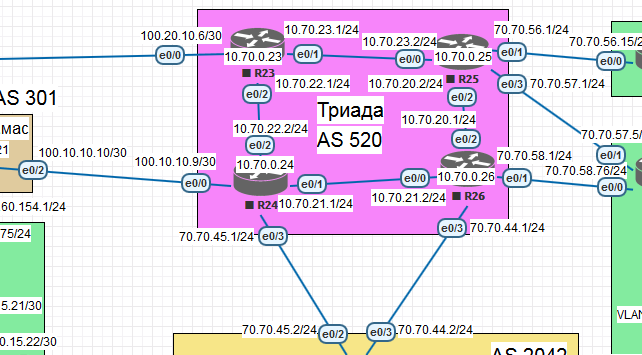

# IS-IS 



## Description

- R23 and R25 in area 2222;
- R24 in area 24;
- R26 in area 26

### IS-IS on R23 and R25 (area 2222)

Level 1 for matched areas (default Cisco L1/2)

```
interface Ethernet0/0
 no switchport
 ip address 100.20.10.6 255.255.255.252
 ip router isis
!
interface Ethernet0/1
 no switchport
 ip address 10.70.23.1 255.255.255.0
 ip router isis
!
interface Ethernet0/2
 no switchport
 ip address 10.70.22.1 255.255.255.0
 ip router isis
!
router isis
 net 49.2222.0000.0000.0023.00
```
```
interface Ethernet0/0
 no switchport
 ip address 10.70.23.2 255.255.255.0
 ip router isis
!
interface Ethernet0/1
 no switchport
 ip address 70.70.56.1 255.255.255.0
!
interface Ethernet0/2
 no switchport
 ip address 10.70.20.2 255.255.255.0
 ip router isis
!
interface Ethernet0/3
 no switchport
 ip address 70.70.57.1 255.255.255.0
!
router isis
 net 49.2222.0000.0000.0025.00

```

### R23 IS-IS diagnostics
```
R23#sh ip protocols
*** IP Routing is NSF aware ***

Routing Protocol is "isis"
  Outgoing update filter list for all interfaces is not set
  Incoming update filter list for all interfaces is not set
  Redistributing: isis
  Address Summarization:
    None
  Maximum path: 4
  Routing for Networks:
    Ethernet0/0
    Ethernet0/1
    Ethernet0/2
  Routing Information Sources:
    Gateway         Distance      Last Update
    70.70.56.1           115      00:30:05
    10.70.22.2           115      00:08:53
    10.70.20.1           115      00:08:53
    10.70.23.2           115      00:30:29
    10.70.20.2           115      00:08:53
    10.70.21.2           115      00:25:02
  Distance: (default is 115)
```
```
R23#sh ip route isis
Codes: L - local, C - connected, S - static, R - RIP, M - mobile, B - BGP
       D - EIGRP, EX - EIGRP external, O - OSPF, IA - OSPF inter area
       N1 - OSPF NSSA external type 1, N2 - OSPF NSSA external type 2
       E1 - OSPF external type 1, E2 - OSPF external type 2
       i - IS-IS, su - IS-IS summary, L1 - IS-IS level-1, L2 - IS-IS level-2
       ia - IS-IS inter area, * - candidate default, U - per-user static route
       o - ODR, P - periodic downloaded static route, H - NHRP, l - LISP
       + - replicated route, % - next hop override

Gateway of last resort is not set

      10.0.0.0/8 is variably subnetted, 6 subnets, 2 masks
i L1     10.70.20.0/24 [115/20] via 10.70.23.2, 00:32:42, Ethernet0/1
i L2     10.70.21.0/24 [115/20] via 10.70.22.2, 00:12:16, Ethernet0/2
```
```
R23#sh isis database

IS-IS Level-1 Link State Database:
LSPID                 LSP Seq Num  LSP Checksum  LSP Holdtime      ATT/P/OL
R23.00-00           * 0x0000000B   0x73E1        1042              1/0/0
R24.00-00             0x00000008   0x3CC1        175               1/0/0
R24.02-00             0x00000002   0xCF05        0 (1154)          0/0/0
R25.00-00             0x00000009   0xB7B9        561               1/0/0
R25.01-00             0x00000003   0xA048        581               0/0/0
IS-IS Level-2 Link State Database:
LSPID                 LSP Seq Num  LSP Checksum  LSP Holdtime      ATT/P/OL
R23.00-00           * 0x0000000D   0x7721        1098              0/0/0
R24.00-00             0x0000000D   0x3C9B        1130              0/0/0
R24.02-00             0x00000004   0x234C        1048              0/0/0
R25.00-00             0x00000004   0xACE5        1088              0/0/0
R25.01-00             0x00000002   0x343C        598               0/0/0
R26.00-00             0x00000009   0xECEB        959               0/0/0
R26.01-00             0x00000004   0x4F1C        1089              0/0/0
R26.02-00             0x00000002   0x6506        556               0/0/0
```
```
R23#sh isis neighbors

System Id      Type Interface   IP Address      State Holdtime Circuit Id
R24            L2   Et0/2       10.70.22.2      UP    9        R24.02           
R25            L1   Et0/1       10.70.23.2      UP    8        R25.01           
R25            L2   Et0/1       10.70.23.2
```
### R25 IS-IS diagnostics
```
R25#sh ip protocols
*** IP Routing is NSF aware ***

Routing Protocol is "isis"
  Outgoing update filter list for all interfaces is not set
  Incoming update filter list for all interfaces is not set
  Redistributing: isis
  Address Summarization:
    None
  Maximum path: 4
  Routing for Networks:
    Ethernet0/0
    Ethernet0/2
  Routing Information Sources:
    Gateway         Distance      Last Update
    10.70.22.2           115      00:00:35
    10.70.20.1           115      00:00:35
    10.70.22.1           115      00:00:35
  Distance: (default is 115)
```
```
R25#sh ip route isis
Codes: L - local, C - connected, S - static, R - RIP, M - mobile, B - BGP
       D - EIGRP, EX - EIGRP external, O - OSPF, IA - OSPF inter area
       N1 - OSPF NSSA external type 1, N2 - OSPF NSSA external type 2
       E1 - OSPF external type 1, E2 - OSPF external type 2
       i - IS-IS, su - IS-IS summary, L1 - IS-IS level-1, L2 - IS-IS level-2
       ia - IS-IS inter area, * - candidate default, U - per-user static route
       o - ODR, P - periodic downloaded static route, H - NHRP, l - LISP
       + - replicated route, % - next hop override

Gateway of last resort is not set

      10.0.0.0/8 is variably subnetted, 6 subnets, 2 masks
i L2     10.70.21.0/24 [115/20] via 10.70.20.1, 00:13:09, Ethernet0/2
i L1     10.70.22.0/24 [115/20] via 10.70.23.1, 00:34:28, Ethernet0/0
      100.0.0.0/30 is subnetted, 1 subnets
i L1     100.20.10.4 [115/20] via 10.70.23.1, 00:34:28, Ethernet
```
```
R25#sh isis database

IS-IS Level-1 Link State Database:
LSPID                 LSP Seq Num  LSP Checksum  LSP Holdtime      ATT/P/OL
R23.00-00             0x0000000B   0x73E1        996               1/0/0
R24.00-00             0x00000008   0x3CC1        129               1/0/0
R25.00-00           * 0x00000009   0xB7B9        519               1/0/0
R25.01-00           * 0x00000003   0xA048        540               0/0/0
IS-IS Level-2 Link State Database:
LSPID                 LSP Seq Num  LSP Checksum  LSP Holdtime      ATT/P/OL
R23.00-00             0x0000000D   0x7721        1052              0/0/0
R24.00-00             0x0000000D   0x3C9B        1084              0/0/0
R24.02-00             0x00000004   0x234C        1003              0/0/0
R25.00-00           * 0x00000004   0xACE5        1046              0/0/0
R25.01-00           * 0x00000002   0x343C        556               0/0/0
R26.00-00             0x00000009   0xECEB        917               0/0/0
R26.01-00             0x00000004   0x4F1C        1047              0/0/0
R26.02-00             0x00000002   0x6506        514               0/0/0
```
```
R25#sh isis neighbors

System Id      Type Interface   IP Address      State Holdtime Circuit Id
R23            L1   Et0/0       10.70.23.1      UP    23       R25.01           
R23            L2   Et0/0       10.70.23.1      UP    21       R25.01           
R26            L2   Et0/2       10.70.20.1      UP    9        R26.02   
```

### IS-IS on R24 (area 24)

Level 2 for different areas (default Cisco L1/2)
 
```
interface Ethernet0/0
 no switchport
 ip address 100.10.10.9 255.255.255.252
!
interface Ethernet0/1
 no switchport
 ip address 10.70.21.1 255.255.255.0
 ip router isis
!
interface Ethernet0/2
 no switchport
 ip address 10.70.22.2 255.255.255.0
 ip router isis
!
interface Ethernet0/3
 no switchport
 ip address 70.70.45.1 255.255.255.0
!
router isis
 net 49.0024.0000.0000.0024.00

```
### IS-IS on R26 (area 26)

Level 2 for different areas (default Cisco L1/2)

```
interface Ethernet0/0
 no switchport
 ip address 10.70.21.2 255.255.255.0
 ip router isis
!
interface Ethernet0/1
 no switchport
 ip address 70.70.58.1 255.255.255.0
!
interface Ethernet0/2
 no switchport
 ip address 10.70.20.1 255.255.255.0
 ip router isis
!
interface Ethernet0/3
 no switchport
 ip address 70.70.44.1 255.255.255.0
!
router isis
 net 49.0026.0000.0000.0026.00
!
```

### R24 IS-IS diagnostics
```
R24#sh ip protocols
*** IP Routing is NSF aware ***

Routing Protocol is "isis"
  Outgoing update filter list for all interfaces is not set
  Incoming update filter list for all interfaces is not set
  Redistributing: isis
  Address Summarization:
    None
  Maximum path: 4
  Routing for Networks:
    Ethernet0/1
    Ethernet0/2
  Routing Information Sources:
    Gateway         Distance      Last Update
    10.70.20.1           115      00:10:43
    10.70.20.2           115      00:10:43
    10.70.21.2           115      00:26:42
    10.70.22.1           115      00:10:43
  Distance: (default is 115)
```
```
R24#sh ip route isis
Codes: L - local, C - connected, S - static, R - RIP, M - mobile, B - BGP
       D - EIGRP, EX - EIGRP external, O - OSPF, IA - OSPF inter area
       N1 - OSPF NSSA external type 1, N2 - OSPF NSSA external type 2
       E1 - OSPF external type 1, E2 - OSPF external type 2
       i - IS-IS, su - IS-IS summary, L1 - IS-IS level-1, L2 - IS-IS level-2
       ia - IS-IS inter area, * - candidate default, U - per-user static route
       o - ODR, P - periodic downloaded static route, H - NHRP, l - LISP
       + - replicated route, % - next hop override

Gateway of last resort is not set

      10.0.0.0/8 is variably subnetted, 6 subnets, 2 masks
i L2     10.70.20.0/24 [115/20] via 10.70.21.2, 00:13:53, Ethernet0/1
i L2     10.70.23.0/24 [115/20] via 10.70.22.1, 00:13:53, Ethernet0/2
      100.0.0.0/8 is variably subnetted, 3 subnets, 2 masks
i L2     100.20.10.4/30 [115/20] via 10.70.22.1, 00:13:53, Ethernet0/2
```
```
R24#sh isis neighbors

System Id      Type Interface   IP Address      State Holdtime Circuit Id
R23            L2   Et0/2       10.70.22.1      UP    24       R24.02           
R26            L2   Et0/1       10.70.21.2      UP    7        R26.01    
```

### R26 IS-IS diagnostics
```
R26#sh ip protocols
*** IP Routing is NSF aware ***

Routing Protocol is "isis"
  Outgoing update filter list for all interfaces is not set
  Incoming update filter list for all interfaces is not set
  Redistributing: isis
  Address Summarization:
    None
  Maximum path: 4
  Routing for Networks:
    Ethernet0/0
    Ethernet0/2
  Routing Information Sources:
    Gateway         Distance      Last Update
    10.70.22.2           115      00:11:18
    10.70.20.2           115      00:11:18
    10.70.22.1           115      00:11:18
  Distance: (default is 115)
```
```
R26#sh ip route isis
Codes: L - local, C - connected, S - static, R - RIP, M - mobile, B - BGP
       D - EIGRP, EX - EIGRP external, O - OSPF, IA - OSPF inter area
       N1 - OSPF NSSA external type 1, N2 - OSPF NSSA external type 2
       E1 - OSPF external type 1, E2 - OSPF external type 2
       i - IS-IS, su - IS-IS summary, L1 - IS-IS level-1, L2 - IS-IS level-2
       ia - IS-IS inter area, * - candidate default, U - per-user static route
       o - ODR, P - periodic downloaded static route, H - NHRP, l - LISP
       + - replicated route, % - next hop override

Gateway of last resort is not set

      10.0.0.0/8 is variably subnetted, 6 subnets, 2 masks
i L2     10.70.22.0/24 [115/20] via 10.70.21.1, 00:30:31, Ethernet0/0
i L2     10.70.23.0/24 [115/20] via 10.70.20.2, 00:22:09, Ethernet0/2
      100.0.0.0/30 is subnetted, 1 subnets
i L2     100.20.10.4 [115/30] via 10.70.21.1, 00:14:40, Ethernet0/0
                     [115/30] via 10.70.20.2, 00:14:40, Ethernet0/2
```
```
R26#sh isis neighbors

System Id      Type Interface   IP Address      State Holdtime Circuit Id
R24            L2   Et0/0       10.70.21.1      UP    25       R26.01           
R25            L2   Et0/2       10.70.20.2      UP    25       R26.02   
```
