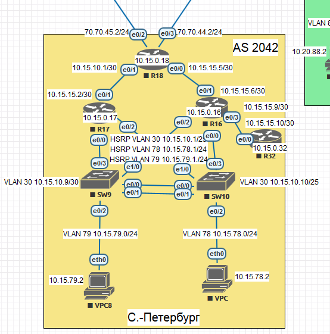

# EIGRP named-mode



## Description

- R32 get default route only;
- R16 and R17 annonce sum prefixes only
- R18 has static IPv4/6 routes to providers

### Named EIGRP R32
```
router eigrp R32
 !
 address-family ipv4 unicast autonomous-system 4
  !
  topology base
  exit-af-topology
  network 10.15.15.8 0.0.0.3
  eigrp router-id 32.32.32.32
 exit-address-family
 !
 address-family ipv6 unicast autonomous-system 6
  !
  topology base
  exit-af-topology
  eigrp router-id 32.32.32.32
 exit-address-family
```

### R32 diagnostics
```
R32#sh ip route eigrp
Codes: L - local, C - connected, S - static, R - RIP, M - mobile, B - BGP
       D - EIGRP, EX - EIGRP external, O - OSPF, IA - OSPF inter area
       N1 - OSPF NSSA external type 1, N2 - OSPF NSSA external type 2
       E1 - OSPF external type 1, E2 - OSPF external type 2
       i - IS-IS, su - IS-IS summary, L1 - IS-IS level-1, L2 - IS-IS level-2
       ia - IS-IS inter area, * - candidate default, U - per-user static route
       o - ODR, P - periodic downloaded static route, H - NHRP, l - LISP
       + - replicated route, % - next hop override

Gateway of last resort is 10.15.15.9 to network 0.0.0.0

D*EX  0.0.0.0/0 [170/332800] via 10.15.15.9, 00:20:54, Ethernet0/0
      10.0.0.0/8 is variably subnetted, 4 subnets, 2 masks
D        10.15.15.0/30 [90/332800] via 10.15.15.9, 00:52:50, Ethernet0/0
D        10.15.15.4/30 [90/307200] via 10.15.15.9, 00:52:50, Ethernet0/0
      70.0.0.0/24 is subnetted, 2 subnets
D EX     70.70.44.0 [170/332800] via 10.15.15.9, 00:19:11, Ethernet0/0
D EX     70.70.45.0 [170/332800] via 10.15.15.9, 00:20:54, Ethernet0/0

R32#sh ipv6 route eigrp
IPv6 Routing Table - default - 10 entries
Codes: C - Connected, L - Local, S - Static, U - Per-user Static route
       B - BGP, R - RIP, I1 - ISIS L1, I2 - ISIS L2
       IA - ISIS interarea, IS - ISIS summary, D - EIGRP, EX - EIGRP external
       ND - ND Default, NDp - ND Prefix, DCE - Destination, NDr - Redirect
       O - OSPF Intra, OI - OSPF Inter, OE1 - OSPF ext 1, OE2 - OSPF ext 2
       ON1 - OSPF NSSA ext 1, ON2 - OSPF NSSA ext 2
EX  ::/0 [170/307200]
     via FE80::A8BB:CCFF:FE01:30, Ethernet0/0
D   2001:2042:0:2::/64 [90/332800]
     via FE80::A8BB:CCFF:FE01:30, Ethernet0/0
D   2001:2042:0:3::/64 [90/307200]
     via FE80::A8BB:CCFF:FE01:30, Ethernet0/0
D   2001:2042:0:5::/64 [90/307200]
     via FE80::A8BB:CCFF:FE01:30, Ethernet0/0
D   2001:2042:0:15::/64 [90/358400]
     via FE80::A8BB:CCFF:FE01:30, Ethernet0/0
D   2001:7070:44::/64 [90/332800]
     via FE80::A8BB:CCFF:FE01:30, Ethernet0/0
D   2001:7070:45::/64 [90/332800]
     via FE80::A8BB:CCFF:FE01:30, Ethernet0/0
```

### Named EIGRP R16 and R17 
```
router eigrp R16
 !
 address-family ipv4 unicast autonomous-system 4
  !
  af-interface Ethernet0/0
   passive-interface
  exit-af-interface
  !
  topology base
  exit-af-topology
  network 10.15.15.4 0.0.0.3
  network 10.15.15.8 0.0.0.3
  eigrp router-id 16.16.16.16
 exit-address-family
 !
 address-family ipv6 unicast autonomous-system 6
  !
  af-interface Ethernet0/0
   passive-interface
  exit-af-interface
  !
  topology base
  exit-af-topology
  eigrp router-id 16.16.16.16
 exit-address-family
```
```
router eigrp R17
 !
 address-family ipv4 unicast autonomous-system 4
  !
  af-interface Ethernet0/0
   passive-interface
  exit-af-interface
  !
  topology base
  exit-af-topology
  network 10.15.15.0 0.0.0.3
  eigrp router-id 17.17.17.17
 exit-address-family
 !
 address-family ipv6 unicast autonomous-system 6
  !
  af-interface Ethernet0/0
   passive-interface
  exit-af-interface
  !
  topology base
  exit-af-topology
  eigrp router-id 17.17.17.17
 exit-address-family
```
### R16 diagnostics
```
R16#sh ip route eigrp
Codes: L - local, C - connected, S - static, R - RIP, M - mobile, B - BGP
       D - EIGRP, EX - EIGRP external, O - OSPF, IA - OSPF inter area
       N1 - OSPF NSSA external type 1, N2 - OSPF NSSA external type 2
       E1 - OSPF external type 1, E2 - OSPF external type 2
       i - IS-IS, su - IS-IS summary, L1 - IS-IS level-1, L2 - IS-IS level-2
       ia - IS-IS inter area, * - candidate default, U - per-user static route
       o - ODR, P - periodic downloaded static route, H - NHRP, l - LISP
       + - replicated route, % - next hop override

Gateway of last resort is 10.15.15.5 to network 0.0.0.0

D*EX  0.0.0.0/0 [170/307200] via 10.15.15.5, 00:24:42, Ethernet0/1
      10.0.0.0/8 is variably subnetted, 5 subnets, 2 masks
D        10.15.15.0/30 [90/307200] via 10.15.15.5, 01:15:15, Ethernet0/1
      70.0.0.0/24 is subnetted, 2 subnets
D EX     70.70.44.0 [170/307200] via 10.15.15.5, 00:22:59, Ethernet0/1
D EX     70.70.45.0 [170/307200] via 10.15.15.5, 00:24:42, Ethernet


R16#sh ipv6 route eigrp
IPv6 Routing Table - default - 11 entries
Codes: C - Connected, L - Local, S - Static, U - Per-user Static route
       B - BGP, R - RIP, I1 - ISIS L1, I2 - ISIS L2
       IA - ISIS interarea, IS - ISIS summary, D - EIGRP, EX - EIGRP external
       ND - ND Default, NDp - ND Prefix, DCE - Destination, NDr - Redirect
       O - OSPF Intra, OI - OSPF Inter, OE1 - OSPF ext 1, OE2 - OSPF ext 2
       ON1 - OSPF NSSA ext 1, ON2 - OSPF NSSA ext 2
EX  ::/0 [170/281600]
     via FE80::A8BB:CCFF:FE01:2000, Ethernet0/1
D   2001:2042:0:1::/64 [90/307200]
     via FE80::A8BB:CCFF:FE02:0, Ethernet0/3
D   2001:2042:0:2::/64 [90/307200]
     via FE80::A8BB:CCFF:FE01:2000, Ethernet0/1
D   2001:2042:0:15::/64 [90/332800]
     via FE80::A8BB:CCFF:FE01:2000, Ethernet0/1
D   2001:7070:44::/64 [90/307200]
     via FE80::A8BB:CCFF:FE01:2000, Ethernet0/1
D   2001:7070:45::/64 [90/307200]
     via FE80::A8BB:CCFF:FE01:2000, Ethernet0/1
```

### R17 diagnostics
```
R17#sh ip route eigrp
Codes: L - local, C - connected, S - static, R - RIP, M - mobile, B - BGP
       D - EIGRP, EX - EIGRP external, O - OSPF, IA - OSPF inter area
       N1 - OSPF NSSA external type 1, N2 - OSPF NSSA external type 2
       E1 - OSPF external type 1, E2 - OSPF external type 2
       i - IS-IS, su - IS-IS summary, L1 - IS-IS level-1, L2 - IS-IS level-2
       ia - IS-IS inter area, * - candidate default, U - per-user static route
       o - ODR, P - periodic downloaded static route, H - NHRP, l - LISP
       + - replicated route, % - next hop override

Gateway of last resort is 10.15.15.1 to network 0.0.0.0

D*EX  0.0.0.0/0 [170/307200] via 10.15.15.1, 00:23:59, Ethernet0/1
      10.0.0.0/8 is variably subnetted, 4 subnets, 2 masks
D        10.15.15.4/30 [90/307200] via 10.15.15.1, 01:14:35, Ethernet0/1
D        10.15.15.8/30 [90/332800] via 10.15.15.1, 01:14:33, Ethernet0/1
      70.0.0.0/24 is subnetted, 2 subnets
D EX     70.70.44.0 [170/307200] via 10.15.15.1, 00:22:16, Ethernet0/1
D EX     70.70.45.0 [170/307200] via 10.15.15.1, 00:23:59, Ethernet0/1


R17#sh ipv6 route eigrp
IPv6 Routing Table - default - 10 entries
Codes: C - Connected, L - Local, S - Static, U - Per-user Static route
       B - BGP, R - RIP, I1 - ISIS L1, I2 - ISIS L2
       IA - ISIS interarea, IS - ISIS summary, D - EIGRP, EX - EIGRP external
       ND - ND Default, NDp - ND Prefix, DCE - Destination, NDr - Redirect
       O - OSPF Intra, OI - OSPF Inter, OE1 - OSPF ext 1, OE2 - OSPF ext 2
       ON1 - OSPF NSSA ext 1, ON2 - OSPF NSSA ext 2
EX  ::/0 [170/281600]
     via FE80::A8BB:CCFF:FE01:2010, Ethernet0/1
D   2001:2042:0:1::/64 [90/358400]
     via FE80::A8BB:CCFF:FE01:2010, Ethernet0/1
D   2001:2042:0:2::/64 [90/307200]
     via FE80::A8BB:CCFF:FE01:2010, Ethernet0/1
D   2001:2042:0:3::/64 [90/307200]
     via FE80::A8BB:CCFF:FE01:2010, Ethernet0/1
D   2001:2042:0:5::/64 [90/332800]
     via FE80::A8BB:CCFF:FE01:2010, Ethernet0/1
D   2001:7070:44::/64 [90/307200]
     via FE80::A8BB:CCFF:FE01:2010, Ethernet0/1
D   2001:7070:45::/64 [90/307200]
     via FE80::A8BB:CCFF:FE01:2010, Ethernet0/1
```

### Named EIGRP R18
```
router eigrp R18
 !
 address-family ipv4 unicast autonomous-system 4
  !
  topology base
   redistribute connected
   redistribute static
  exit-af-topology
  network 10.15.15.0 0.0.0.3
  network 10.15.15.4 0.0.0.3
  eigrp router-id 18.18.18.18
 exit-address-family
 !
 address-family ipv6 unicast autonomous-system 6
  !
  topology base
   redistribute connected
   redistribute static
  exit-af-topology
  eigrp router-id 18.18.18.18
 exit-address-family
```

### R18 diagnostics
```
R18#sh ip route eigrp
Codes: L - local, C - connected, S - static, R - RIP, M - mobile, B - BGP
       D - EIGRP, EX - EIGRP external, O - OSPF, IA - OSPF inter area
       N1 - OSPF NSSA external type 1, N2 - OSPF NSSA external type 2
       E1 - OSPF external type 1, E2 - OSPF external type 2
       i - IS-IS, su - IS-IS summary, L1 - IS-IS level-1, L2 - IS-IS level-2
       ia - IS-IS inter area, * - candidate default, U - per-user static route
       o - ODR, P - periodic downloaded static route, H - NHRP, l - LISP
       + - replicated route, % - next hop override

Gateway of last resort is 70.70.45.1 to network 0.0.0.0

      10.0.0.0/8 is variably subnetted, 5 subnets, 2 masks
D        10.15.15.8/30 [90/307200] via 10.15.15.6, 01:05:49, Ethernet0/0

R18#sh ipv6 route eigrp
IPv6 Routing Table - default - 13 entries
Codes: C - Connected, L - Local, S - Static, U - Per-user Static route
       B - BGP, R - RIP, I1 - ISIS L1, I2 - ISIS L2
       IA - ISIS interarea, IS - ISIS summary, D - EIGRP, EX - EIGRP external
       ND - ND Default, NDp - ND Prefix, DCE - Destination, NDr - Redirect
       O - OSPF Intra, OI - OSPF Inter, OE1 - OSPF ext 1, OE2 - OSPF ext 2
       ON1 - OSPF NSSA ext 1, ON2 - OSPF NSSA ext 2
D   2001:2042:0:1::/64 [90/332800]
     via FE80::A8BB:CCFF:FE01:10, Ethernet0/0
D   2001:2042:0:5::/64 [90/307200]
     via FE80::A8BB:CCFF:FE01:10, Ethernet0/0
D   2001:2042:0:15::/64 [90/307200]
     via FE80::A8BB:CCFF:FE01:1010, Ethernet0/1
```