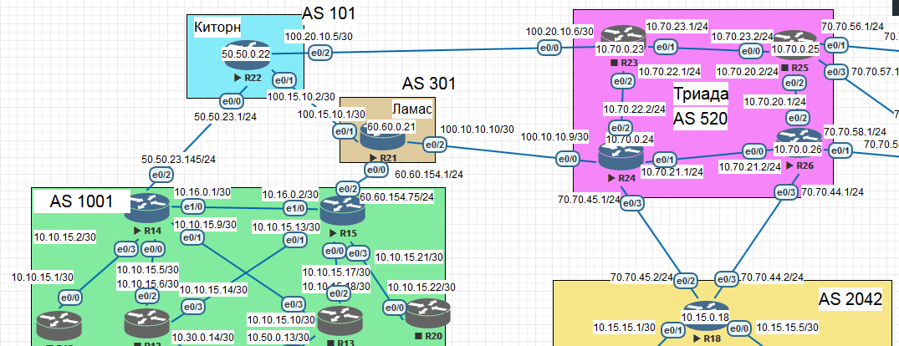

# eBGP



## Description

- eBGP between R14 (AS1001) - R22 (AS101) and R15 (AS1001) - R21 (AS301);
- eBGP between R18 (AS2042) - R24/26 (AS520);
- eBGP between R22 (AS101) - R21 (AS301);
- eBGP between R21 (AS301) - R24 (AS520);
- AS1001 can reach AS2042 and vice versa

### Main conceepts

- Instead of setting IP SLA using explicit BGP session close command "neighbor a.b.c.d fall-over";
- MSK (AS1001) and SPB (AS2042) will get summary route information by "network" command. To make BGP announce networks
from routing table "Null 0", interface "Null 0" with static routing will be added too "ip route a.b.c.d mask Null0";
- Kitorn, Lamas, and Triada will annonce default route using BGP using "neighbor a.b.c.d default-originate";
- Kitorn and Lamas will annonce our summary routes to their networks;
- Triada will annonce all internal networks because AS nees to anonce all internal networks, but offices shoud get only summary
routes (needs filtering which will be implemented in next labs);
- Triada will not have full mesh between routers (iBGP will be implemented in next labs);
- Triada will redistribute connected and static networks to have inter-AS binding by using "redistribute connected" and "redistribute static"

### eBGP R14-R22 and R15-R21
```
R14#sh run

router bgp 1001
 bgp router-id 14.14.14.14
 bgp log-neighbor-changes
 neighbor 50.50.23.1 remote-as 101
 neighbor 50.50.23.1 fall-over
 !
 address-family ipv4
  network 10.10.0.0 mask 255.255.0.0
  neighbor 50.50.23.1 activate
 exit-address-family
!
!
no ip http server
!
ip route 0.0.0.0 0.0.0.0 50.50.23.1
ip route 10.10.0.0 255.255.0.0 Null0
```
```
R22#sh run

router bgp 101
 bgp router-id 22.22.22.22
 bgp log-neighbor-changes
 neighbor 50.50.23.145 remote-as 1001
 neighbor 100.15.10.1 remote-as 301
 !
 address-family ipv4
  neighbor 50.50.23.145 activate
  neighbor 50.50.23.145 default-originate
  neighbor 100.15.10.1 activate
 exit-address-family
!
!
no ip http server
!
ip route 50.50.0.0 255.255.0.0 Null0
```
```
R15#sh run

router bgp 1001
 bgp router-id 15.15.15.15
 bgp log-neighbor-changes
 neighbor 60.60.154.1 remote-as 301
 neighbor 60.60.154.1 fall-over
 !
 address-family ipv4
  network 10.10.0.0 mask 255.255.0.0
  neighbor 60.60.154.1 activate
 exit-address-family
!
!
no ip http server
!
ip route 0.0.0.0 0.0.0.0 60.60.154.1
ip route 10.10.0.0 255.255.0.0 Null0
```
```
R21#sh run

router bgp 301
 bgp router-id 21.21.21.21
 bgp log-neighbor-changes
 neighbor 60.60.154.75 remote-as 1001
 neighbor 100.10.10.9 remote-as 520
 neighbor 100.15.10.2 remote-as 101
 !
 address-family ipv4
  network 60.60.0.0 mask 255.255.0.0
  neighbor 60.60.154.75 activate
  neighbor 60.60.154.75 default-originate
  neighbor 100.10.10.9 activate
  neighbor 100.15.10.2 activate
 exit-address-family
!
!
no ip http server
!
ip route 60.60.0.0 255.255.0.0 Null0
```
### R14-R22 and R15-R21 diagnostics
```
R14#sh ip bgp summary
BGP router identifier 14.14.14.14, local AS number 1001
BGP table version is 1, main routing table version 1

Neighbor        V           AS MsgRcvd MsgSent   TblVer  InQ OutQ Up/Down  State/PfxRcd
50.50.23.1      4          101      34      35        1    0    0 00:29:23        0
```
```
R22#sh ip bgp summary
BGP router identifier 22.22.22.22, local AS number 101
BGP table version is 1, main routing table version 1

Neighbor        V           AS MsgRcvd MsgSent   TblVer  InQ OutQ Up/Down  State/PfxRcd
50.50.23.145    4         1001      36      34        1    0    0 00:30:07        0
100.15.10.1     4          301      41      42        1    0    0 00:34:29        0
```
```
R15#sh ip bgp summary
BGP router identifier 15.15.15.15, local AS number 1001
BGP table version is 1, main routing table version 1

Neighbor        V           AS MsgRcvd MsgSent   TblVer  InQ OutQ Up/Down  State/PfxRcd
60.60.154.1     4          301      28      30        1    0    0 00:24:36        0
```
```
R21#sh ip bgp summary
BGP router identifier 21.21.21.21, local AS number 301
BGP table version is 1, main routing table version 1

Neighbor        V           AS MsgRcvd MsgSent   TblVer  InQ OutQ Up/Down  State/PfxRcd
60.60.154.75    4         1001      31      29        1    0    0 00:25:10        0
100.10.10.9     4          520      27      25        1    0    0 00:21:18        0
100.15.10.2     4          101      43      43        1    0    0 00:35:49        0
```
### eBGP R18-R24/26 
```
R18#sh run

router bgp 2042
 bgp router-id 18.18.18.18
 bgp log-neighbor-changes
 neighbor 70.70.44.1 remote-as 520
 neighbor 70.70.44.1 fall-over
 neighbor 70.70.45.1 remote-as 520
 neighbor 70.70.45.1 fall-over
 !
 address-family ipv4
  network 10.15.0.0 mask 255.255.0.0
  neighbor 70.70.44.1 activate
  neighbor 70.70.45.1 activate
 exit-address-family
!
!
no ip http server
!
ip route 0.0.0.0 0.0.0.0 70.70.45.1
ip route 0.0.0.0 0.0.0.0 70.70.44.1
ip route 10.15.0.0 255.255.0.0 Null0
```
```
R24#sh run

router bgp 520
 bgp router-id 24.24.24.24
 bgp log-neighbor-changes
 neighbor 10.70.21.2 remote-as 520
 neighbor 70.70.45.2 remote-as 2042
 neighbor 100.10.10.10 remote-as 301
 !
 address-family ipv4
  neighbor 10.70.21.2 activate
  neighbor 70.70.45.2 activate
  neighbor 70.70.45.2 default-originate
  neighbor 100.10.10.10 activate
 exit-address-family
!
!
no ip http server
!
ip route 10.70.0.0 255.255.0.0 Null0
```
```
R26#sh run

router bgp 520
 bgp router-id 26.26.26.26
 bgp log-neighbor-changes
 neighbor 10.70.21.1 remote-as 520
 neighbor 70.70.44.2 remote-as 2042
 !
 address-family ipv4
  network 10.70.0.0 mask 255.255.0.0
  redistribute connected
  redistribute static
  neighbor 10.70.21.1 activate
  neighbor 70.70.44.2 activate
  neighbor 70.70.44.2 default-originate
 exit-address-family
!
!
no ip http server
!
ip route 10.70.0.0 255.255.0.0 Null0
```
### R18-R24/26 diagnostics
```
R18#sh ip bgp summary
BGP router identifier 18.18.18.18, local AS number 2042
BGP table version is 1, main routing table version 1

Neighbor        V           AS MsgRcvd MsgSent   TblVer  InQ OutQ Up/Down  State/PfxRcd
70.70.44.1      4          520      23      20        1    0    0 00:17:05        0
70.70.45.1      4          520      21      23        1    0    0 00:17:24        0
```
```
R24#sh ip bgp summary
BGP router identifier 24.24.24.24, local AS number 520
BGP table version is 1, main routing table version 1

Neighbor        V           AS MsgRcvd MsgSent   TblVer  InQ OutQ Up/Down  State/PfxRcd
10.70.21.2      4          520      29      28        1    0    0 00:22:57        0
70.70.45.2      4         2042      26      24        1    0    0 00:20:36        0
100.10.10.10    4          301      32      33        1    0    0 00:27:08        0
```
```
R26#sh ip bgp summary
BGP router identifier 26.26.26.26, local AS number 520
BGP table version is 1, main routing table version 1

Neighbor        V           AS MsgRcvd MsgSent   TblVer  InQ OutQ Up/Down  State/PfxRcd
10.70.21.1      4          520      29      30        1    0    0 00:23:50        0
70.70.44.2      4         2042      25      27        1    0    0 00:21:11        0
```
### eBGP R22-R21
```
R22#sh run

router bgp 101
 bgp router-id 22.22.22.22
 bgp log-neighbor-changes
 neighbor 50.50.23.145 remote-as 1001
 neighbor 100.15.10.1 remote-as 301
 !
 address-family ipv4
  neighbor 50.50.23.145 activate
  neighbor 50.50.23.145 default-originate
  neighbor 100.15.10.1 activate
 exit-address-family
!
!
no ip http server
!
ip route 50.50.0.0 255.255.0.0 Null0
!
```
```
R21#sh run

router bgp 301
 bgp router-id 21.21.21.21
 bgp log-neighbor-changes
 neighbor 60.60.154.75 remote-as 1001
 neighbor 100.10.10.9 remote-as 520
 neighbor 100.15.10.2 remote-as 101
 !
 address-family ipv4
  network 60.60.0.0 mask 255.255.0.0
  neighbor 60.60.154.75 activate
  neighbor 60.60.154.75 default-originate
  neighbor 100.10.10.9 activate
  neighbor 100.15.10.2 activate
 exit-address-family
!
!
no ip http server
!
ip route 60.60.0.0 255.255.0.0 Null0
```
### R22-R21 diagnostics
```
R22#sh ip bgp summary
BGP router identifier 22.22.22.22, local AS number 101
BGP table version is 1, main routing table version 1

Neighbor        V           AS MsgRcvd MsgSent   TblVer  InQ OutQ Up/Down  State/PfxRcd
50.50.23.145    4         1001      47      46        1    0    0 00:40:35        0
100.15.10.1     4          301      53      53        1    0    0 00:44:57        0
```
```
R21#sh ip bgp summary
BGP router identifier 21.21.21.21, local AS number 301
BGP table version is 1, main routing table version 1

Neighbor        V           AS MsgRcvd MsgSent   TblVer  InQ OutQ Up/Down  State/PfxRcd
60.60.154.75    4         1001      31      29        1    0    0 00:25:10        0
100.10.10.9     4          520      27      25        1    0    0 00:21:18        0
100.15.10.2     4          101      43      43        1    0    0 00:35:49        0
```
### eBGP R21-R24
```
R21#sh run

router bgp 301
 bgp router-id 21.21.21.21
 bgp log-neighbor-changes
 neighbor 60.60.154.75 remote-as 1001
 neighbor 100.10.10.9 remote-as 520
 neighbor 100.15.10.2 remote-as 101
 !
 address-family ipv4
  network 60.60.0.0 mask 255.255.0.0
  neighbor 60.60.154.75 activate
  neighbor 60.60.154.75 default-originate
  neighbor 100.10.10.9 activate
  neighbor 100.15.10.2 activate
 exit-address-family
!
!
no ip http server
!
ip route 60.60.0.0 255.255.0.0 Null0
```
```
R24#sh run

router bgp 520
 bgp router-id 24.24.24.24
 bgp log-neighbor-changes
 neighbor 10.70.21.2 remote-as 520
 neighbor 70.70.45.2 remote-as 2042
 neighbor 100.10.10.10 remote-as 301
 !
 address-family ipv4
  neighbor 10.70.21.2 activate
  neighbor 70.70.45.2 activate
  neighbor 70.70.45.2 default-originate
  neighbor 100.10.10.10 activate
 exit-address-family
!
!
no ip http server
!
ip route 10.70.0.0 255.255.0.0 Null0
```
### R21-R24 diagnostics
```
R21#sh ip bgp summary
BGP router identifier 21.21.21.21, local AS number 301
BGP table version is 1, main routing table version 1

Neighbor        V           AS MsgRcvd MsgSent   TblVer  InQ OutQ Up/Down  State/PfxRcd
60.60.154.75    4         1001      45      43        1    0    0 00:37:35        0
100.10.10.9     4          520      41      39        1    0    0 00:33:42        0
100.15.10.2     4          101      57      56        1    0    0 00:48:14        0
```
```
R24#sh ip bgp summary
BGP router identifier 24.24.24.24, local AS number 520
BGP table version is 1, main routing table version 1

Neighbor        V           AS MsgRcvd MsgSent   TblVer  InQ OutQ Up/Down  State/PfxRcd
10.70.21.2      4          520      29      28        1    0    0 00:22:57        0
70.70.45.2      4         2042      26      24        1    0    0 00:20:36        0
100.10.10.10    4          301      32      33        1    0    0 00:27:08        0
```